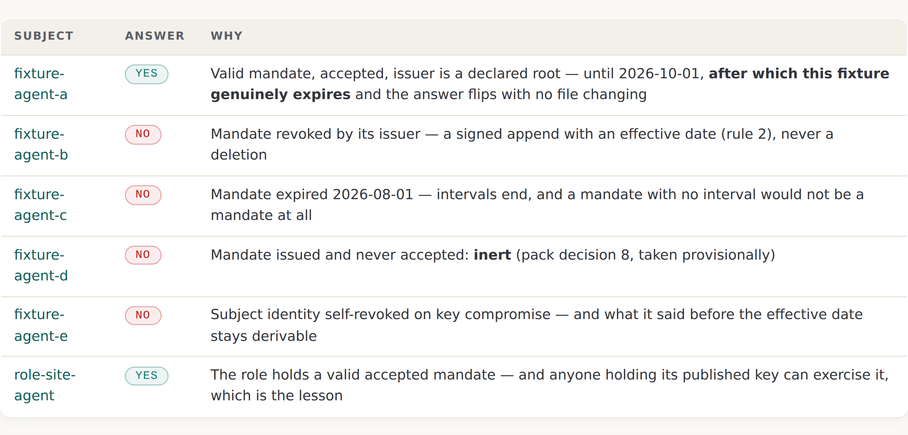

# 8 · The register

*Part three — What was built*

---

Eleven records. Twenty-three signed statements. Four assumable roles. One declared root. Six expected verification answers shipped as data, and a validator that reproduces all six.

Ten of the eleven records have their private keys published beside their public halves, on purpose, and every signature on them verifies and proves nothing.

This chapter walks it, runs it, and states what each part is worth in the same breath.

## What is actually there

The register is at `https://pki.sgit.ai/registry/` and it is static files. No account, no API key, no session, no server-side logic of any kind. Every artefact is fetchable at a constructed URL, and that is a promise rather than an accident.

```
  registry/
    params.json                        canonicalisation, signature, fingerprint recipes
    roots.json                         one declared root — a FIXTURE root, and it says so
    roles.json                         four published roles and how to assume one
    capabilities.json                  the fixture capability vocabulary (v0)
    index.json                         convenience map, NO AUTHORITY, regenerable
    views/expected-verifications.json  six cases and their expected answers
    views/excess-authority.json        grant minus mandate, per subject
    records/<sha256-hex16>/            one directory per record, named by the
      01__identity.json                owner's signing fingerprint
      NN__<type>__<slug>.json          further statements
      record.json                      unsigned manifest, NO AUTHORITY
      public/sign.pem  public/encrypt.pem
      private/…  keystore/…            FIXTURES ONLY — published on purpose
    tools/registry_tool.py             generator, verifier, validator, enrolment helper
```

The twenty-three statements break down as eleven identities, five mandates, four acceptances, two revocations and one grant. Every one is an immutable signed file.

Three files in that listing say *NO AUTHORITY* about themselves. That is not modesty. `index.json` and `record.json` and both views are derived — regenerable by anybody from the signed statements — and Chapter 5's rule applies: a derived thing carries no authority because it can be recomputed, and if it disagrees with the statements the statements win. The specification is explicit that a verifier **must not** rely on `index.json` for any step.

## The flag you read first

Before any signature on any record, one field.

**Figure 4 · The fixture flag, read before any signature.**
*Read `private_key_published` before you read the signature. And note `publication_intent: deliberate` — a secret is defined by expectation, not by content, so the intention is recorded at issue, because afterwards a deliberate publication and a leak look identical.*

```json
{
  "body": {
    "agent_type": "operator",
    "claims": {
      "note": "FIXTURE — exists to exercise the plumbing; its signatures prove nothing (change-control C3)"
    },
    "private_key_paths": ["private/sign.pem", "private/encrypt.pem"],
    "private_key_published": true,
    "publication_intent": "deliberate"
  },
  "created_at": "2026-08-25T09:00:00Z",
  "record": "sha256:90f97984b9cf3930",
  "registry": "pki.sgit.ai",
  "signer": "sha256:90f97984b9cf3930",
  "type": "identity",
  "v": 1
}
```

Ten of the eleven records read like that. The eleventh returns `false`, and that single `false` is what makes the whole scheme work as evidence. The register's front door states the reasoning:

> ONE RECORD IS REAL (private_key_published: false) — which is what makes the flag evidence rather than a column.

*Stated.* A flag that is true on every row is not evidence; it is a column. It carries no information, it costs nothing to ignore, and readers correctly learn to skip it. One row where it is false is what makes reading it worth the effort.

The `publication_intent` field is a separate idea and a better one than it looks. The estate's key policy holds that **a secret is defined by expectation, not by content**, and that the intention has to be recorded at issue — because afterwards, a deliberate publication and a leak are indistinguishable. There is no forensic difference between a private key that was published on purpose and one that got out. The only difference is a claim somebody made beforehand, which is why it is a field.

## The forgery

The fastest way to understand what a fixture signature is worth is to produce one.

**Figure 7 · The forgery, executed.**
*`Verified OK` on a document that says `anyone can sign this`. Nothing failed. That is the point: a signature anybody can produce conveys nothing, and the register verifies it exactly as diligently as any other.*

```
$ printf '{"forged":"anyone can sign this"}' > forged.json
$ openssl dgst -sha256 -sign $R/private/sign.pem forged.json > forged.der
$ openssl dgst -sha256 -verify $R/public/sign.pem -signature forged.der forged.json
Verified OK

# The private half is published in this repository. So is everybody's.
```

Three commands, no cleverness, no vulnerability. The private half of the registry's operator root is a file in a public repository, so anybody can sign as the operator root, and the verification succeeds because the signature is genuinely valid.

The register's own front door puts the general form of it:

> What a verified signature proves here: that the statement was signed by a holder of that private key. What that is worth on a FIXTURE record: nothing — you are also a holder of that private key.

*Stated.* A signature is a claim about scarcity. It says: whoever produced this held something few others hold. Remove the scarcity and the mechanism keeps working perfectly while the claim it carries becomes empty. The mathematics is unaffected. The meaning is gone.

This is the sharpest reason the estate declined a proposal it considered and rejected — per-object keypairs with published private halves. Those would leave a hash wearing a signature's clothes, defeat their own stated use, and make the fixture flag true on every row. Which returns to the same point: a flag that is always true is a column, not evidence.

## The verification walk

The register answers one question — *may agent X exercise capability C right now?* — and the walk is published as a procedure. Read it as a sequence of refusals as much as of checks.

Fetch `roots.json` and `params.json`. Fetch the subject record. **Read the fixture flag.** Verify every statement's signature against the owner's key, and reject any statement whose signer is not the owner. Check for an identity revocation. Follow acceptances to mandates in issuer records. Verify the issuer's record the same way. Require the issuer in `roots.json`. Check revocations against the mandate. Check the validity interval.

Then answer YES with expiry and authority, NO with the reason, or **STOPPED** with where the chain ended.

Two steps in that list are doing more than they appear to.

**Reject any statement whose signer is not the owner.** The front door explains why, and it is the 2019 catastrophe compiled into a single check: *a valid signature by a non-owner is the 2019 keyserver failure, not write authority.* Rule 1 as an executable test. A cryptographically perfect signature from the wrong party is exactly what destroyed the last generation, and here it is a rejection rather than an append.

**STOPPED is a legitimate output.** A partial resolution is not a failure. This is the estate's five-state discipline arriving in the answer space: *confirmed*, *denied*, *unknown*, *unreachable* and *not checked* are five different situations, and collapsing them into pass/fail loses the three that matter most operationally. An implementation must not render *unreachable* as *denied*.

## Six answers, and four of them are NO

**Figure 3 · The six answers a verifier must get right.**
*Four of the six answers are NO, and they are NO for four different reasons — revoked, expired, never accepted, identity revoked. A verifier that collapses those into one failure state is wrong on three of them.*



| Subject | Answer | Why |
|---|---|---|
| `fixture-agent-a` | **YES** | Valid mandate, accepted, issuer is a declared root — until 2026-10-01, after which this fixture genuinely expires and the answer flips with no file changing |
| `fixture-agent-b` | **NO** | Mandate revoked by its issuer — a signed append with an effective date (rule 2), never a deletion |
| `fixture-agent-c` | **NO** | Mandate expired 2026-08-01 — intervals end, and a mandate with no interval would not be a mandate at all |
| `fixture-agent-d` | **NO** | Mandate issued and never accepted: **inert** (pack decision 8, taken provisionally) |
| `fixture-agent-e` | **NO** | Subject identity self-revoked on key compromise — and what it said before the effective date stays derivable |
| `role-site-agent` | **YES** | The role holds a valid accepted mandate — and anyone holding its published key can exercise it, which is the lesson |

The `fixture-agent-a` row contains something rare in a fixture set: a live clock. That mandate expires on 1 October 2026. Nothing needs to be edited for the answer to change; the file stays exactly as it is and the answer flips, because the interval is real and time passes. **A fixture with a genuine expiry is a test that maintains itself**, and it is the only part of this register that will be more honest next month than it is today.

The `fixture-agent-d` row is the estate's most provisional answer. Whether an unaccepted mandate is inert or live on issue is open decision Q6, taken provisionally as inert. The fixture demonstrates the choice rather than justifying it, and the register says so.

## Running it

**Figure 5 · The verification walk, executed.**
*Six expected answers, six reproduced — and the fixture line printed for every record before any of them. The validator reads the flag first by construction, not by convention.*

```
$ cd registry && python3 tools/registry_tool.py validate
  ✓ fixture-agent-a — valid, accepted mandate: YES (expected YES) — valid until
      2026-10-01T00:00:00Z, on the authority of sha256:90f97984b9cf3930, a declared root
  ✓ fixture-agent-b — mandate revoked by issuer: NO (expected NO) — mandate revoked
      (policy), effective 2026-08-20T00:00:00Z
  ✓ fixture-agent-c — mandate expired: NO (expected NO) — mandate expired 2026-08-01
  ✓ fixture-agent-d — mandate issued, never accepted: NO (expected NO) — a mandate exists
      and its subject has never accepted it — inert (decision 8, provisional)
  ✓ fixture-agent-e — identity self-revoked: NO (expected NO) — subject identity revoked
      (key-compromise), effective 2026-08-24T00:00:00Z
  ✓ role: site-agent: YES (expected YES) — valid until 2026-12-31T00:00:00Z
  · sha256-1ccafd8f3f8906c4: FIXTURE (private key published)
  … (nine more)
  · sha256-f9facb4c94da6c19: REAL identity (private half not published)
registry validate: OK — 11 records (10 fixtures, 1 real), 23 statements, every signature
verified, every reference resolves, no private material outside fixture records, all 6
expected answers reproduced
```

That is executed output, run against the repository at the time of writing. The expected answers ship as data at `views/expected-verifications.json` so that anybody's verifier can be tested against the same six, and the front door states the acceptance criterion with its trap attached:

> If your verifier reproduces all six (as of the file's as_of date), it implements this register's walk. If it passes any of them WITHOUT surfacing the fixture caveat, it skipped the flag rule and is wrong while looking right.

*Stated.* Wrong while looking right is the failure mode this whole register is designed around. A verifier that returns all six correct answers and never mentions that the root is a fixture has produced six technically correct and completely misleading results.

## It really is the shipped format

The register claims compatibility with the `sgit pki` commands, and the claim is established by execution rather than by assumption.

**Figure 6 · Format compatibility with the shipped CLI, executed.**
*The signer line names a fixture. The CLI is not wrong; it is answering the only question a signature can answer — who held the private half — and on this record the answer is everybody.*

```
$ jq -cS 'del(.sig)' $R/02__mandate__pr-create__to-agent-a.json > payload.bin
$ jq '{signature: .sig, fingerprint: .signer}' $R/02__…json > payload.bin.sig
$ jq '.body.bundle' $R/01__identity.json > op-bundle.json
$ sgit pki import op-bundle.json
Imported contact: fixture-operator (pki.sgit.ai)
  Fingerprint: sha256:075693699f0694d0
$ sgit pki verify payload.bin payload.bin.sig
Signature valid (signer: fixture-operator (pki.sgit.ai))
```

Fingerprints are sgit's own 16-hex short form over the DER SubjectPublicKeyInfo. Bundles are byte-shaped like `sgit pki export`. Signatures are raw `r||s` ECDSA P-256 — 64 bytes, not DER — an encoding chosen in sgit's own source for Web Crypto interop, so a browser can verify these statements with no conversion at all.

There is one detail in that transcript worth pausing on, because it is a real design consequence rather than a curiosity. The imported contact's fingerprint is `sha256:075693699f0694d0`, and the record directory is `sha256-90f97984b9cf3930`. Different values, both correct: `sgit` addresses keystore operations by the **encryption** fingerprint, while records here are keyed by the **signing** fingerprint, because registry statements are signed artefacts. Two fingerprints per identity, and a reader who assumes one will conclude the register is inconsistent when it is not.

## The four rules, meeting entries for the first time

Chapter 2 published four rules before there was anything to apply them to. Here is the first honest assessment of how each fares against a real register — and they do not fare equally.

**Rule 1 — only the owner writes to their own record. Holds, twice over.** It holds *by topology*, because the record model is a file in a commit graph and a record directory is named by its owner's fingerprint. And it holds *by check*, because the validator rejects a valid signature by a non-owner. Two independent mechanisms, which is the right number for the rule that the 2019 failure came from.

**Rule 2 — revocation is a signed append. Holds, and is exercised.** Two revocations in the register: one of a mandate by its issuer, one of an identity by itself. Both are appends carrying `effective_from`. The pre-revocation state stays derivable, so *was it valid last Tuesday* still has an answer.

**Rule 3 — records are size-bounded. Does not hold. It is a proposal in a parameters file.** `params.json` carries `max_statement_bytes: 16384` and `max_statements_per_record: 256` under a field that reads `"proposed": true`, with a note recording that draft-1's per-statement bound was doubled because an identity statement carrying two PEM public keys plus the fixture flags runs past 8 KB. Nothing enforces either number. **This is the rule that turns directly on the 2019 attack — one key reached 150,000 signatures because certificates had no size limit — and it is the one rule the register has not implemented.**

**Rule 4 — every entry is signed by something you can check. Holds mechanically; the checkable thing is a fixture.** Every statement carries a signature that resolves against a published key, and the validator verifies all twenty-three. What it resolves to is a root whose private half is in the repository.

*Drawn.* The packs do not score the rules this way, and I think the scoring is the useful output of this chapter: **two rules hold, one is exercised, one is a number in a file.** Rule 3's absence is the most interesting because it is the cheapest to fix and the most directly connected to the documented catastrophe. My reading of why it has not been fixed is that a bound only bites when something approaches it, and nothing in an eleven-record fixture register approaches anything — which means rule 3 is untested for the same reason the whole register is untrustworthy, and both are properties of the population rather than of the design.

## A role is a costume

Four roles ship with published keypairs and drop-in `sgit` keystores, including passphrases. A fresh session assumes a role by retrieval — copy a directory, sign a file, and the CLI reports `Signature valid (signer: role: site-agent)`.

The register states the limit exactly:

> A role is a costume, not an identity. The register can say what the role may do — role-site-agent holds an accepted mandate for repo.pull-request.create on this repository, constrained to registry/** on dev — and can never say who wore it.

*Stated.* And note that this is the sixth verification case: `role-site-agent` returns YES. The register's own acceptance test contains an entry whose correct answer is *yes, and anyone at all may exercise it*. Building the costume lesson into the test set rather than the caveats is the right instinct, and it is the kind of thing that only survives if somebody writes it down as a test.

## The one real identity, and what it cost

`records/sha256-f9facb4c94da6c19` is the authoring session's own identity. Public halves only. `private_key_published: false`. It is the reason the flag is evidence.

It is also honest about a problem it cannot solve: the private half lived only in the authoring session's ephemeral container, so the identity is **session-scoped**. The container is reclaimed after inactivity. The key is gone.

That is the pack's open persistence question, recorded as an executed fact rather than as a design note — which is a better outcome than a design note, and worth naming as a technique. The estate could have written *key persistence is an open question*. Instead it enrolled an identity, discovered where the private half would have to live, found that there was nowhere, and published the record with the problem visible in it.

*Drawn.* Reading the roles material against this record produces a conclusion neither states: the register currently contains exactly two kinds of identity, and neither is the kind it is designed for. Four are costumes anybody can wear, six are fixtures with published keys, and one is real but cannot outlive a container. **The design's central case — an identity whose private half has a good place to live — has zero instances.** The front door says the first real root awaits such an identity. What it does not say is that the same absence applies one layer down, to every subject as well as to the root.

## What this register does not have, deliberately

Four absences, and the register lists them itself rather than leaving them to be discovered:

**No live capability, ever.** Grants carry hashes of what was issued. The one descriptor in this register had its preimage discarded before publication. A registry that contains a secret is a registry with a breach in its future.

**No append-lane write path.** No lane, no processor, no blind acknowledgement. Today the write path is a git commit and the processor is whoever reviews it. Phase 2's questions — lane anchors, token distribution, processor transparency — are untouched, and Chapter 3 covered what the anchors question might do to the design.

**No enforcement.** The register records authority. Nothing in it observes or constrains behaviour. Chapter 10 is the enforcement point, and it is a separate artefact for exactly this reason.

**No trust.** Ten records are fixtures and the root is a fixture. The first real root awaits an identity whose private half has a good place to live.

The register is built. The trustworthy register is not. Every sentence in this chapter is true, and none of them adds up to a reason to rely on anything in it.
