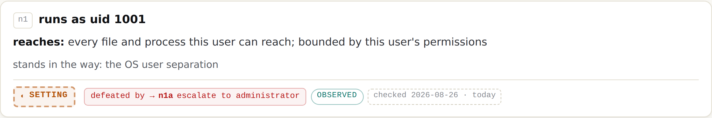
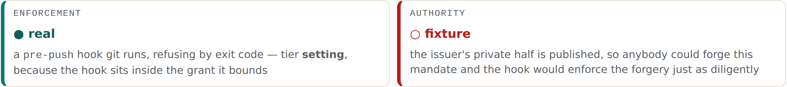

# 11 · The building blocks

*Part three — What was built*

---

Nine primitives, shipped as a stylesheet and a gallery that renders the real documents. This is the smallest artefact in Part three and it is the one that will outlive the others, because a mockup is thrown away and a block is used.

It is also where the estate's rules stop being prose and become things that fail a build.

## What a block is, and what it refuses to be

Each of the nine is a **rendering of a field that already exists in a document**. Never a new fact, never a computed opinion, never a number that averages things that must stay distinct. Document 09 states the consequence as a rule about where errors live:

> if a block needs data no schema carries, the block is wrong, not the schema.

*Stated.* That sentence is the whole discipline. The usual direction of pressure in an interface project runs the other way — the design needs a status, so a status gets invented; the design needs a score, so a score gets computed. Here the direction is reversed by rule, and Chapter 15 records the one place the rule was broken anyway.

The nine: the tier badge, the evidence badge, the freshness chip, the grant node card, the mandate card, the authority/enforcement split, the delta block, the three-term comparison, and the grant tree.

## Five states, two channels, and the word is always one

**Figure 9 · The five tier states.**
*Two channels, never one: the border style carries the state as well as the colour, and the word is always present. `unknown` renders as `unknown` — never as a blank, because a gap is a fact about the floor.*


| State | Means | Rendering |
|---|---|---|
| `boundary` | Enforced by something the grant does **not** include | Solid border, accent. The only state that may look settled |
| `setting` | Enforced by the tool, **inside** the grant | **Dashed** border, warm |
| `expectation` | Nothing enforces it; it is written down | **Dotted** border, red |
| `none` | No control at all | Plain, dim — an absence, stated |
| `unknown` | Not established by the measurement | Dashed, grey, **and never blank** |

The two-channel rule is inherited from a finding the estate got from an outside session, and its reasoning is worth stating because it is usually presented as an accessibility checkbox and is really a correctness one. Colour alone re-collapses five states into two for a substantial fraction of readers. Five states that render as two is not a degraded experience — it is a different and wrong set of facts. So the word is always present, and the border style carries a second channel for anyone reading in greyscale, in print, or through this book.

`unknown` never rendering as blank is the rule most likely to be quietly dropped, because a blank looks tidier and reads as *nothing to see here*. It is not nothing. It is the two nodes in Chapter 9's first library entry that the measurement was refused permission to fill, and they are the two a reviewer would most want. A gap is a fact about the floor.

## The rule that came from the build

The single most valuable rule in the family did not come from design. It came from the estate's own measurement tool publishing a wrong label.

**Figure 10 · The defeated boundary, rendered from real data that is wrong.**
*The stored document says `boundary`. The block renders `setting`, with the defeat path attached. This is the rule working on real data that is wrong — the estate's own measurement tool produced the bad label.*



The stored JSON for that node still says `"tier": "boundary"`, alongside a `SUPERSEDED_BY` key whose value reads:

> see interpretation.finding_1 — this tier label is WRONG, and node n1a is the proof

*Stated.* The gallery renders `setting`, because node `n1a` — *escalate to administrator*, `sudo -n true` succeeded, tier `none` — exists in the same tree. The block corrects the document on render and shows the defeat path that justifies the correction.

The absolute rule:

```
   A control whose defeat path exists in the same tree renders as
   SETTING, with the defeat path reachable from the badge itself.

   ✔  ⛨ setting     defeated by → n1a "escalate to administrator"
   ✘  ⛨ boundary    (with the escalation drawn somewhere else on the page)
```

*Drawn.* What makes this figure worth its place is not the rule; it is that the estate left the bad data in. The easy fix was to correct `n1` to `setting` in the JSON and ship a gallery with nothing to demonstrate. Instead the wrong label stays, marked, and the rendering rule is visible working against it. **A rule demonstrated on correct data is an assertion; a rule demonstrated on data that is wrong is a test.** That is a technique worth stealing independently of anything else in this book, and its cost is that the estate's published library contains a field it knows is false — which Chapter 15 records as a contradiction, because it is one.

## Two indicators, never one

**Figure 11 · The authority/enforcement split.**
*Two indicators, never one. Averaging them into a single status is exactly how a demonstration gets mistaken for a control.*



This is the one block that exists because building the thing taught the pack something the design did not know. Document 09 says so directly: *this is the first block in the family that exists because building the thing taught us something the design did not know.*

The reasoning is Chapter 10's finding turned into a component. The enforcement is real. The authority is a fixture. The two halves are independent, and a single combined status would have to average them.

> A single combined status would have to average them, and averaging them is exactly how a demonstration gets mistaken for a control.

*Stated.* Think about what the average would say. Half-real? Amber? Any single value has to pick a story: *mostly working* understates the authority problem, *not working* understates a hook that genuinely refuses pushes. Both are wrong, and both are wrong in a way that a reader will not be able to recover from the badge.

The document also names what will happen to this block, which is a useful thing for a specification to do: *anybody optimising the interface will try to merge them, and merging them is the failure.*

## The mandate card, and screen four's trap

Chapter 4 covered the rule; the card is where it is enforced. Prohibitions are shown. The allow-list is stored and deliberately not displayed, and the card says so in its own body — that it holds two branch patterns, and that showing the allow-list for approval produces consent without comprehension.

The interval renders as **time remaining**, not only as a date. A mandate expiring next week should look different from one expiring in October, and a date alone requires the reader to do arithmetic they will not do.

And the rendering carries its own date and capability-set version, for Chapter 4's reason: the complement of a fixed allow-list moves when the vocabulary grows, and a regenerated view must not retroactively change what was agreed.

## The delta block, and the rule it breaks

Excess and shortfall, side by side and never stacked — different audiences, different remedies. Each excess row carries the tier of the capability it names, because an excess capability behind a boundary is a different finding from one behind nothing. And no score, ever.

The block's own caption says it is recomputed on render, never stored.

Half of that is true, and Chapter 15 has the details. The excess column is genuinely computed: the mandate's branch patterns are read out of the signed document and matched against a list of branches. The shortfall column is a hardcoded string — *none observed — the mandate asks for nothing the grant lacks* — with no computation behind it at all. And the branch list the excess is computed *against* is a literal in the generator, not read from the library entry, which is how the gallery comes to name a branch the measurement never observed.

*Drawn.* I am putting this in Part three rather than saving it entirely for Part five because it belongs beside the block that demonstrates the estate's best rule. The same gallery contains the estate's most rigorous idea — a rule tested against data it knows to be wrong — and its least rigorous one, a grant partly authored inside a generator by a project whose first correction is that grants must never be authored. Both are real. A reader who takes only the first has been misled by the arrangement.

## The three-term comparison, rendered with a gap

Library, self-report, mandate — three columns, two deltas, and the blind-spot count as the headline.

It renders with the middle column empty, on purpose, because no agent has ever filed a structured self-report. The rule is that a gap renders as a gap.

*Drawn.* This is the estate at its best and it is worth naming why, because the alternative was easy and nobody would have noticed. The block could have shown a plausible number. It would have looked better, demonstrated the layout properly, and been fiction. Choosing to ship the most persuasive block in the family with its persuasive part missing is the same decision as leaving the wrong tier label in the library — and both come from the same rule, which is that the interface renders what the documents contain and never what they ought to contain.

## How they ship, and what they cost

**As a stylesheet and a rendered gallery, not as images.** `assets/gm-blocks.css` is the component layer; the gallery at `https://pki.sgit.ai/packs/grant-and-mandate/blocks.html` renders the actual documents — both library entries and the signed mandate — so the blocks are exercised against real data on every build and a schema change that breaks a block is visible immediately rather than at integration.

That is also what caught the schema drift in Chapter 9: on its first render, the gallery found two evidence values the schema does not define, both in the hand-assembled entry. The generator now fails the build on unrecognised vocabulary, verified by injecting a bad value and watching it exit non-zero.

The costs are stated on the document's face:

**They have met two environments and one mandate**, all measured by one agent. The blocks are specified for a population they have not met.

**The defeat-path rule makes a badge depend on the whole tree**, so a block can no longer be rendered from one node in isolation. That is the price of the rule being correct.

**The tree below 390px has a proposed degradation nobody has tested** — worst path plus a collapse count, which is proposed here and has not been tried on anybody.

**And a shared component layer with no owner drifts into two.** Chapter 12 is where that becomes a contract rather than a worry, because the decision has been made: RiskMandate consumes this stylesheet rather than forking it. Which is the right decision and the one that binds two products to a contract neither has tested at integration.
