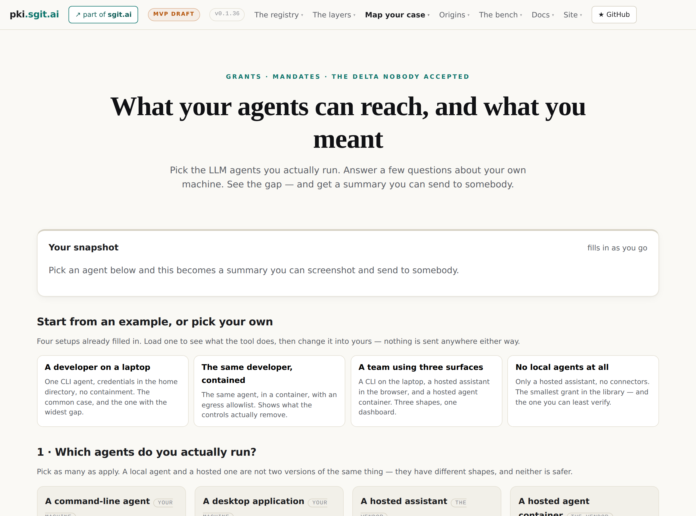

# 13 · Two paths

*Part four — How it composes*

---

A person walks screens and accepts prohibitions. An agent fetches documents and computes deltas.

Neither is the other's fallback. That is the claim of this chapter, and it is a design position rather than an observation, because the usual arrangement is that one of them is a degraded version of the other — an API bolted onto a product built for people, or a web page bolted onto a product built for machines.

## The agent is a primary consumer

The leading brief states it as a constraint on the whole pack, and the three requirements it produces are ones no design review of screens would catch:

> the library must be obtainable in **one fetch**; the agent's output is a **document, not a rendering** (if the interface is where the data lives, the agent path does not exist); and the self-report must be **structured before it is compared**, which is what makes the blind-spot delta computable rather than a judgement.

*Stated.* The parenthesis is the load-bearing part: *if the interface is where the data lives, the agent path does not exist.* Not *is harder* — does not exist. A product whose findings are computed at render time has no agent path, and no amount of API surface creates one, because the API would have to re-derive what the renderer derived.

The pack's acceptance test is phrased that way, and the detail worth noticing is that **no page is read by a human anywhere in it.**

## The agent path, walked

It is the verification walk of Chapter 8 plus the arithmetic of Chapter 5, and it needs nothing but a fetch.

```
  1  GET /registry/llms.txt                 the front door, with the fixture warning first
  2  GET /registry/params.json              canonicalisation, signature and fingerprint recipes
     GET /registry/roots.json               the declared roots — and their fixture flags
  3  GET /registry/records/<fp>/01__identity.json
                                            READ private_key_published BEFORE anything else
  4  verify every statement against the owner's key
     reject any statement whose signer is not the owner        ← rule 1, executable
  5  follow acceptances to mandates in issuer records; verify those the same way
  6  require the issuer in roots.json; check revocations; check the interval
  7  answer YES with expiry and authority · NO with the reason ·
     STOPPED with where the chain ended
```

Four properties of that walk are worth naming because they are what make it an agent path rather than an API.

**No account, no key, no session.** Every artefact is at a constructed URL. An agent with an HTTP client and a JSON parser is a first-class client.

**The recipes are published rather than assumed.** `params.json` carries the canonicalisation version, and the refusal rule attached to it is the interesting part: *a verifier that does not implement this canonicalisation version must refuse the statement rather than guess.* Refuse rather than guess is the same discipline as `unknown` rather than blank, at the protocol layer.

**The acceptance test ships as data.** `views/expected-verifications.json` is six cases and six answers. Write a verifier, run it against the file, and you know whether you implemented the walk — without asking anybody.

**And STOPPED is an answer.** A partial resolution is a legitimate output, not a failure. An agent that can only say yes or no will report *no* where the truth is *I could not reach the issuer's record*, and those are different facts with different remedies.

There is one thing the agent path cannot do, and Chapter 8 covered it: a verifier that reproduces all six answers **without surfacing the fixture caveat** has skipped the flag rule and is wrong while looking right. The mechanical test passes. The output is misleading. This is the one place where the agent path depends on something that cannot be checked by a test, which is why the reference card at the end of this book carries two sentences an agent must repeat if it summarises anything from this estate.

## The person path, walked

The assessment at `https://pki.sgit.ai/assess/index.html` is the same model with a person in it, and it is the one artefact in this estate a non-technical reader can use today.

**Figure 12 · The assessment, mid-flow.**
*Escalation is drawn as an edge, not written as a note — so the reader sees the path that goes around a stated control rather than reading that one exists.*



The flow is Chapter 7's ordering rule with a user interface on it. You pick the agents you run and the surface you run them on — **named products** inside four surface archetypes, because naming one means measuring it and a category nobody recognises is a category nobody picks. You tick what you meant the agent to do. Facts about your own machine **prune the graph**. And you are shown what is reachable that you never intended.

Three design rules shape it, and each is a rejection of something more obvious.

**Escalation is drawn as an edge.** Chapter 11's defeat-path rule at tree scale. You see the path that goes around a stated control, rather than reading a sentence saying one exists. The registry pack records this as a correction found by building rather than by design — escalation was originally tracked on the winning path only, so *all* of the escalations were hidden.

**Controls are things you tick as already true, with their effect computed rather than asserted.** Not a checklist of recommendations. A statement about what is already the case, and the tool computes what it does to your own gap.

**And the gap is a picture.** The graph is hand-written SVG with no charting library — because a CDN dependency would put a third-party request on a page whose whole argument is that you can open the network panel and watch nothing leave.

## Store the choices, not the answers

The rule that shaped the person path more than any other, and it is worth stating carefully because it is a genuine constraint rather than a privacy statement.

A completed assessment describes which agents somebody runs, holding which credentials, with which containment. Assembled, **that is a serviceable plan for attacking them.**

So what is stored is identifiers from a public library, plus fixed options, plus derived dates. And it is implemented as strictly as it can be: **there is no free-text input anywhere on the page.** Not sanitised, not validated — absent. A field that does not exist cannot leak, cannot be exfiltrated, and cannot be filled in with something regrettable.

Browser storage here is not a placeholder either. It makes the no-collection claim **architectural rather than operational**, and checkable in the network panel in ten seconds. The difference matters: an operational promise is *we do not keep it*, which you must take on trust. An architectural one is *it never left*, which you can verify yourself while the page is open.

That strictness has a cost the estate records rather than hides. With no free text, the acceptor is a **role** rather than a named person — and the pack's own standard asks for a named acceptor. The page cannot meet the estate's own standard, and it says so instead of quietly relaxing either the rule or the standard.

*Drawn.* This is the cleanest example in the estate of two of its own rules colliding, and I think the resolution is instructive rather than embarrassing. *Store the choices, not the answers* and *acceptance requires a named acceptor* cannot both hold in a browser-only tool. The estate chose the data rule and published the failure against the other. The alternative — a named-acceptor field, stored locally, promised never to be sent — would have satisfied both documents on paper and made the no-collection claim operational rather than architectural. **The visible failure is the stronger position**, and it is only visible because somebody wrote down that it was a failure.

## Neither is the other's fallback

Now the claim itself, and why it is not just a nice symmetry.

The two paths **serve different questions**. The agent path answers *may this agent exercise this capability right now* — a resolution question, with a determinate answer, executed against signed statements. The person path answers *what can the things I run reach that I never intended* — an orientation question, with no determinate answer, whose output is a picture and a decision.

They **produce different objects**. The agent's output is a document. The person's output is a set of choices plus a decision per gap. Neither is a rendering of the other.

And they **have different failure modes**, which is the practical reason for keeping them separate. The agent path fails by being *wrong while looking right* — six correct answers with the fixture caveat dropped. The person path fails by **producing denial**: the estate cites the standing meta-analysis on fear appeals, which finds defensive response and behaviour change correlate negatively, and draws the design consequence that a frightening page with no credible action performs worse than saying nothing.

So the person path's rule is that every case ends on something the visitor can perform, with the number of their own gaps it closes **computed rather than asserted**. And where nothing can be performed — the hosted case, whose containment is the vendor's and is uninspectable and unattestable — the flow ends on a **request** rather than a remedy: ask the vendor for an endpoint that signs an existing audit record for a named relying party.

*Drawn.* The estate calls that case *zero efficacy by construction*, and I think ending it on a request is the most honest move in the whole assessment. It is also an admission the estate does not quite make out loud: **for the largest population of agent users — people running hosted agents they cannot inspect — this entire model produces a question to ask somebody else.** The vocabulary works, the measurement works, the delta computes, and the remedy is a letter. That is not a flaw in the design. It is what the design correctly reports about a situation where the containment belongs to a party who has not agreed to be measured.

## One model, two renderings, one gap it cannot close

The two paths share the grant, the mandate, the tier vocabulary, and the delta. They diverge only in what they hand back.

What neither can supply is the receipt. The agent path establishes what an agent may do. The person path establishes what an installation can reach. Chapter 1's fourth row is still empty: **nothing here records what actually happened.** The site names the execution broker as the layer that would and does not own it, and this book does not have it either.
