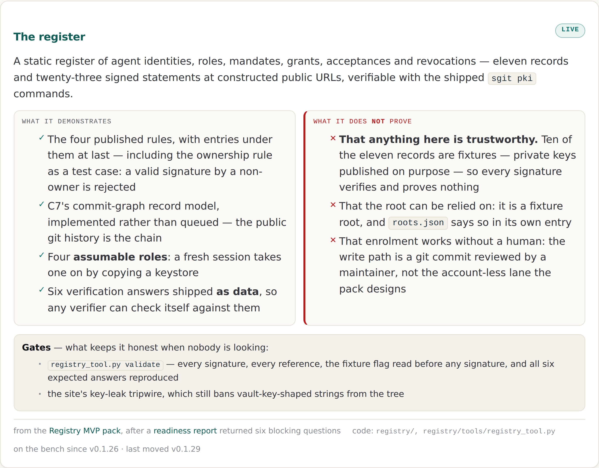
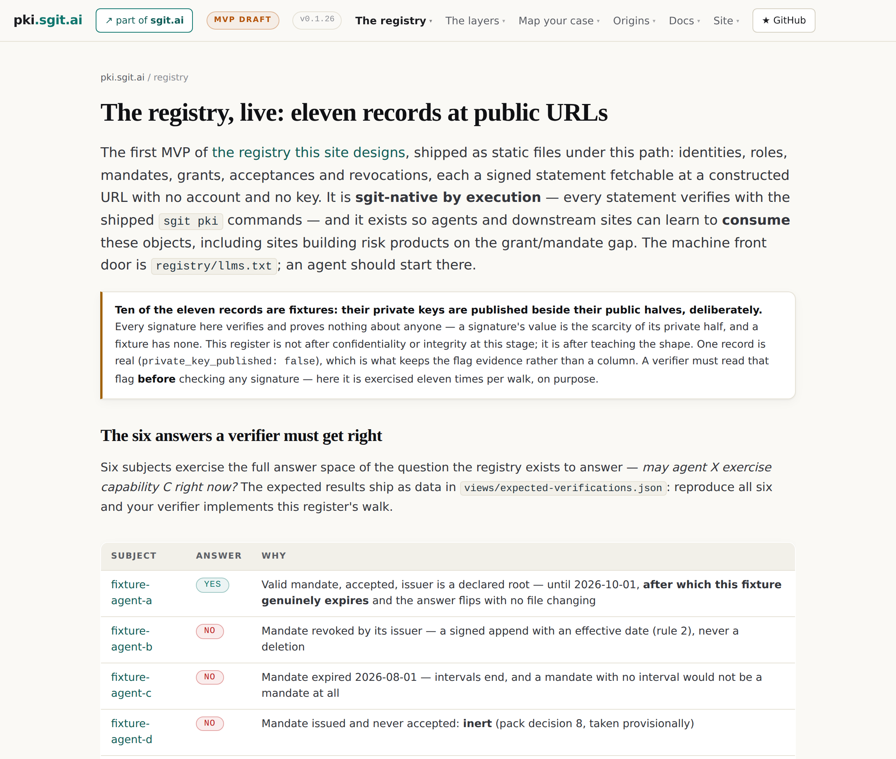
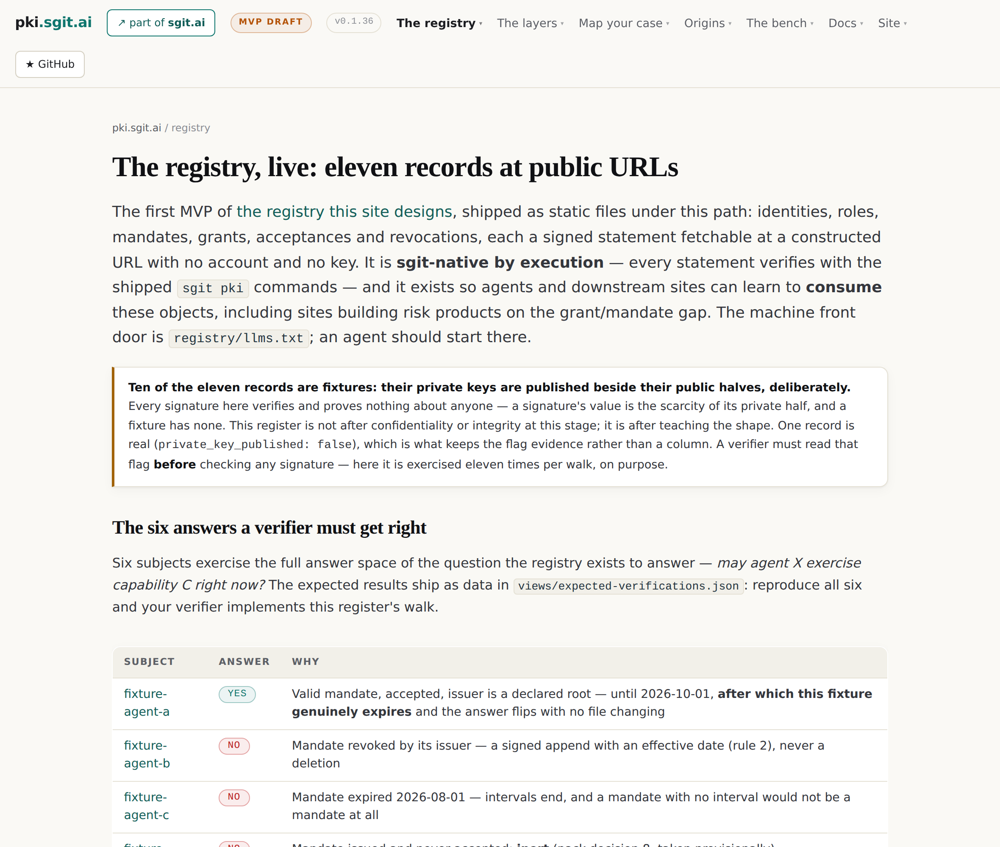

# 14 · Eight releases in forty hours

*Part four — How it composes*

---

The commissioning brief asked for a chapter called *Eight releases in four days*. The repository disagrees, and the brief's own rule is that where a number in it disagrees with the repository, the repository wins. So:

```
$ for t in v0.1.25 … v0.1.32; do git log -1 --format='%cI' $t; done
  v0.1.25   2026-08-25T01:46:32Z
  v0.1.26   2026-08-25T02:44:32Z
  v0.1.27   2026-08-26T13:43:46Z
  v0.1.28   2026-08-26T15:14:16Z
  v0.1.29   2026-08-26T16:01:00Z
  v0.1.30   2026-08-26T17:16:28Z
  v0.1.31   2026-08-26T17:30:38Z
  v0.1.32   2026-08-26T17:48:00Z

  span: 40.0 hours, across two UTC calendar days
```

Eight releases, forty hours, two days. Six of the eight landed within four and a half hours of each other on one afternoon.

*Drawn.* The discrepancy is worth one sentence rather than a paragraph, and it is a mild vindication of the discipline that produced it: the release-history page dates each entry by **when the work was done**, and git dates it by **when it was released**. Six of the site's thirty-five releases carry a page date earlier than their tag date, and v0.1.25 is the worst at four days. Neither number is a lie; they measure different events. But *eight releases in four days* read off the page and *eight releases in forty hours* read off the repository are different claims about how fast this estate moves, and only one of them is checkable.

This chapter is the eight, told through what each one **learned** rather than what it shipped.

## The spine

| Release | What moved from written to built | What it learned |
|---|---|---|
| **v0.1.25** | MC11 — a readiness review's finding, recorded | Capture reads as coverage until an implementer asks it for a tree |
| **v0.1.26** | The **register**: 11 records, 23 statements, 4 roles, 6 answers, a validator | Three blocking questions were answerable by building rather than deciding |
| **v0.1.27** | The **Grant & Mandate pack** and the first measured library entry | The measurement refused to measure itself — and the refusal was the sharpest datum |
| **v0.1.28** | **Enforcement**: a mandate compiled into a `pre-push` hook | The control refused the release carrying its own documentation |
| **v0.1.29** | The **second library entry**, measured inside a CI runner | Two defects, both found by measurement rather than review |
| **v0.1.30** | The **build record**, and the registry pack superseding its own status | A discipline that records corrections and no deliveries drifts into believing it built less than it did |
| **v0.1.31** | The **building blocks** — nine primitives as a stylesheet and a gallery | Rendering real documents caught schema drift on the first render |
| **v0.1.32** | The **bench**, with one mandatory field | A section that collected demonstrations without limits would manufacture false assurance |

## v0.1.25 — a finding that lived only in a chat message

The pack for the assessment was read, for the first time, as an implementation brief: *can this actually be built from these documents?* The answer surfaced a gap the register did not hold — one of five grant-ordered scenarios had no tree to point at. No nodes, no facts, no tiers, no re-run method anywhere in the library.

What makes this a good opening beat is the reason it was recorded at all. The review's other blocking items turned out to already be on the register as open decisions. This one lived only in a chat message.

The lesson the release records is transferable: **capture reads as coverage until an implementer asks it for a tree.** A body of documentation can look complete in every dimension a reader can check, and be missing the one thing a builder needs, and nothing in the reading will reveal which.

## v0.1.26 — the register, and questions answered by building

The register shipped: eleven records, twenty-three signed statements, four assumable roles, six expected answers as data, a validator that reproduces all six. Chapter 8 is this release.

Two architectural facts were established rather than asserted. The record model is C7's commit graph — no `seq`, no `prev`, the public git history is the chain — making this the first implementation of a correction the pack had marked *settled, change queued*. And the register is **sgit-native by execution**, round-tripped in both directions against sgit-ai v0.16.0, which closed the pack's longest-standing dependency flag.

But the thing this release learned is about the readiness report that preceded it. That report returned six blocking questions. **Three were closed by execution** — which record model, what the CLI accepts and emits, and processor transparency for the git write path. Three remain open and are the project lead's.

*Drawn.* The estate treats three-of-six as a good result and I think the more useful reading is about *which* three closed. The three that closed were all questions of the form *what is true?* — answerable by trying it. The three that remain are *what should be the case?* — the capability vocabulary, the lane-anchors experiment nobody has run, and acceptance semantics. Building answered every question that building could answer, and none of the others, and it did so in under an hour. **The estate's velocity is real and it is entirely in one category of question.** Chapters 15 and 16 are largely about the other category.

## v0.1.27 — the pack, and a measurement that refused itself

Eight documents, two schemas, the library, and the first measured entry — of the very environment that produced the pack.

The inventory step both source briefs demand was run before anything was designed, and it changed the build: Cedar adopted rather than reinvented, the sibling estate's conventions adopted, and **only the mandate document built** — the one thing nothing in the industry provides.

And the measurement refused to measure itself. Chapter 9 is that. A boundary-tier control, observed working, on the measuring agent, produced by accident by a tool built to demonstrate something else.

## v0.1.28 — the control blocks its own release

Chapter 10 is this release, and the finding is the best one in the estate.

Within an hour of installation, the hook refused the release push that would have published its own documentation. The correct remedy was not `--no-verify` and not editing the hook: mandate v1 was **wrong**, narrower than the authorisation that actually existed. The issuer amended it, citing the instruction and carrying an interval.

**The refusal is what forced the authorisation to be written down.**

And it produced the artefact-level consequence Chapter 10 documents: the release that records the refusal cannot contain the state that produced it, because the amendment had to happen before the release could be pushed. That is not a defect. It is what remediation does, and it is a hazard for anybody who documents their own controls firing.

## v0.1.29 — two defects, both found by a machine

The second library entry, measured inside a CI runner by the same tool. Deliberately the other end of the first entry's node n3, so the two join at that edge and together are the blast-radius path.

Two defects surfaced by measurement rather than review. The tool labelled the OS user separation a `boundary` while the next node showed passwordless `sudo` succeeding — the pack's own warning, reproduced by an automated measurer, because tiers were decided in isolation. And the pre-push hook does not travel with a clone: the file is committed, the config that activates it is local, so **the control is one un-run command away from being absent.**

Both recorded rather than tidied away, with the wrong label kept visible.

## v0.1.30 — the discipline corrects itself

The most self-referential release, and the one that says most about how the estate works.

This estate records every correction meticulously and had recorded **no deliveries at all**. The cost was visible and specific: three days after the register shipped, the registry MVP pack still described it as entirely unbuilt in three places, because nothing in the discipline obliged anyone to write down that something was finished.

Two fixes. Document 08, the build record — what moved from specified to built, with a fetchable artefact named for every claim, and a flat list of what is still only written down, *because a build record that lists only deliveries is a sales document.* And C33/C34 in the registry pack, superseding its own unbuilt status rather than editing it.

*Drawn.* The general form is worth extracting, because it is a failure mode of good practice rather than of bad. **A supersede-never-rewrite discipline is asymmetric by construction: it has a mechanism for recording that a claim became wrong, and none for recording that a plan became true.** Corrections have an appendix; deliveries have nowhere to go. So the corpus drifts toward pessimism about itself, which is a nicer direction to drift than the alternative and is still drift. The fix — a build record beside the change control — is small, and the estate needed a visible three-day contradiction to notice it was needed.

## v0.1.31 — the blocks, and a rule from the build

Nine primitives as components with rendering rules rather than pictures, because a mockup is thrown away and a block is used. Chapter 11 is this release.

Its load-bearing rule came from the build rather than from design: a tier is a property of a node's relationship to the tree, not of the node. And it adds the one block that exists because building taught the pack something it did not know — the authority/enforcement split, two indicators and never one.

On its first render the gallery caught two schema violations in the pack's own library, and **all of them were in the hand-assembled entry while the tool-generated one had none.** GM1 proving itself on the pack's own data.

## v0.1.32 — one mandatory field

The bench: a first-class section collecting what the site has actually built, where every entry must state what it does **not** prove, and the build fails without it — verified by emptying one and watching the generator exit non-zero.

**Figure 1 · The bench, two columns.**
*The two columns are the same width. The limits are not a footnote to the claims — they are set beside them, at equal weight, and the generator refuses to build an entry whose right-hand column is empty.*



Two decisions in that release are worth carrying.

**The limits render at equal weight**, beside the claims, rather than smaller or greyer. That is the whole difference between a bench and a showcase, and it is a typographic decision doing an editorial job.

**It is called a bench rather than labs, deliberately.** In this industry *labs* signals *unsupported, may vanish* — and these are the most rigorously checked artefacts on the site. They are simply not finished products. A bench is where you put something to test it and read the result honestly.

## What four days looks like from inside

Six of the eight releases landed in four and a half hours. That is fast because the register is files and the pack is markdown, and because nothing in it has met a user, a stranger's agent, or an adversary.

**Figure 2 · The register, then and now.**
*The register on the day it shipped, and the same page four days later. What changed is not the architecture but the number of places the page admits something — the corrections accumulated faster than the features.*





The pair of panels is the most honest picture in this book of what four days of work does to an estate like this one. Between v0.1.26 and now, the architecture did not move. The record model, the four rules, the statement types, the walk — all as shipped. What grew was the admitting: more places where the page says what a thing does not prove, more fixture warnings, more limits stated at the point where the claim is made rather than at the bottom.

*Drawn.* Which produces the reading I would put on this whole chapter, and it is not the flattering one. **The estate's rate of building and its rate of self-correction are the same rate**, because they are the same activity: almost every release in this table shipped a thing and a finding about the previous thing. That is a genuinely good property and it has a limit that four days cannot reveal, because every finding so far has come from the estate examining its own work. Nobody outside has been asked whether any of it is needed. Chapter 16 is where that stops being an aside.
