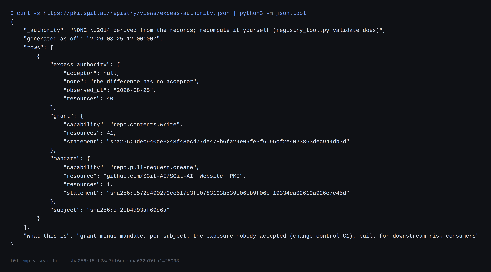

# 1 · The empty seat

*Part one — The pivot*

---

Since 25 August 2026, the register at pki.sgit.ai has published a small JSON document called the excess-authority view. It is generated from the records, carries a banner disclaiming its own authority, and contains one row. The row says that a measured environment — the container this book's own writing session runs in belongs to the same family — holds a grant reaching <!-- gen:stat:grant_resources -->41<!-- /gen:stat:grant_resources --> resources, under a mandate that covers <!-- gen:stat:mandate_resources -->1<!-- /gen:stat:mandate_resources -->. And inside that row sits a field that is the reason this book exists:

> "acceptor": null

*Stated* — from `registry/views/excess-authority.json`, where it has been published since before anyone said the word insurance. The note beside it reads, in full:

> the difference has no acceptor

*Stated.* The estate's own hardest sentence had always been that excess authority is unaccepted *by construction*: nobody can accept an exposure nobody has written down, and once it is written down, it turns out nobody wants to. The register did the writing down. The seat stayed empty.

On 30 August the project lead recorded a voice memo that begins, in the way these memos begin, mid-thought:

> so I want to do a little pivot on the on the risk mandate and the sort of the risk approach

*Stated* — from the transcript filed verbatim as brief v0.33.71 before it was read, because in this corpus the transcript outranks any summary of it. The pivot it announces is structural. The chain this estate publishes ends *reality → twin → facts → finding → risks → decisions*, with **risk acceptance** as the terminal act: an owner signs that the organisation chooses to carry an exposure. The memo replaces the terminal node. Instead of an acceptance at the foundation, an **insurance policy**.

And the reason is one sentence, the one this book is named after:

> the difference between what the agent can do, right, which is the the grant, and what we want the agent to do, which is the mandate, the delta of that, is where the insurance lives

*Stated* — the memo, verbatim, hesitations and all. The delta between grant and mandate is not new to this estate; measuring it is most of what the estate does. What is new is the observation that the rest of the economy already has a name for the party who takes on an exposure its owner will not carry: an **insurer**. An underwriter accepts, for money, what no owner accepted. The empty seat the register has been publishing is, literally, the seat a policy sits in.

## A stricter consumer, not a new machine

It would be reasonable to expect a pivot of this size to obsolete the work before it. It does the opposite, and the memo says so —

> what's cool about it is that we already have, I think, a lot of the primitives

*Stated.* Insurance consumes exactly the artefacts this estate already produces, and the mapping is nearly embarrassing in how little invention it needs. A proposal form is a **measured grant** — the twin, generated by measurement and honest about its own blindness. A policy schedule is a **mandate** — issuer, subject, scope, interval, signed: the five fields of a schedule are the five fields a mandate already has. Exclusions are the mandate's **prohibitions**. Warranties are **facts** attached to the twin, and a breached warranty voids cover exactly as a flipped fact drops an enforcement tier. The insurable interest of the novel cover is the **delta** itself, computed and never stored. The underwriting evidence is the **evidence pack** the workbench already emits.

*Drawn.* The right way to say this is that the pivot upgrades the *audience* for the estate's evidence rather than the evidence. An acceptance can, in the worst case, be theatre — a signature over an exposure nobody measured. The first brief's reading put the upgrade in one line: a policy is a stricter consumer of exactly the same artefacts, because the measurement now has to be good enough that a stranger will bet on it. The estate spent August building for a reader who ought to believe it. Insurance supplies a reader who is paid not to.

## The one primitive that does not exist

The mapping has exactly one empty cell, and it is the one insurance cannot do without. Everything above prices the *ex ante* side — what could go wrong, how reachable it is, what stands in the way. A payout needs the *ex post* side: a **loss event**. What happened, attributable to which subject, exercising which capability, with what severity. Nothing in the register, the pack or the workbench records harm; the closest object the estate owns is an evidence pack for a *refused* action, which is a loss event's exact opposite.

*Drawn.* That absence is worth savouring, because it is the pivot's most precise output: a corpus that has spent a month recording what agents can do, are allowed to do, and were refused from doing has no schema for what an agent *did wrong*. The memo's payout logic — *"if this happens then you get this payout"* — forces `loss-event/v0` into existence as a shape, and whoever's schema records agent losses will own the eventual actuarial table. That is a strategic sentence wearing a technical one, and chapter 16 returns to it.

## Parametric, named

The memo describes its payout logic without naming the industry term for it:

> we can say hey if this happens then you get this payout if that happens, then you get this, and then we can connect that straight away to those capabilities

*Stated.* Insurance has two payout shapes. **Indemnity** pays the assessed actual loss, and needs adjusters, disputes, and an actuarial depth nobody has for agents. **Parametric** pays a pre-agreed amount when a defined, measurable event occurs — no loss adjuster, no negotiation; the trigger either fired or it did not. It exists for earthquakes and flight delays, where the event data is strong and the loss data is weak, and that is precisely the situation here: every trigger an agent policy would plausibly name — an action outside the mandate executed, a mandate expired with the agent still operating, a warranty fact gone false, a twin gone stale past the re-measurement clause — is *already computable from published documents*.

*Drawn.* Parametric is the estate's good luck, and its honest limit arrives in the same breath: a computable trigger is not a computable loss. Parametric accepts basis risk — the payout may not match the harm — as the price of not needing the loss data that does not exist. This book will keep meeting that trade, because stage 1 makes it again at a larger scale: chapter 4 removes the money entirely, for the same reason parametric removes the adjuster.

## What the seat costs to fill

*Drawn.* One more thing follows from reading the pivot off the register rather than off a slide deck. When the acceptor field is null, the estate's current behaviour is that the exposure defaults to critical and escalates — an alarm with no owner. Fill the seat with a policy and something better happens than silence: *deploying an uninsured agent* becomes a governance event anyone can check, the way an uninsured contractor on a site is a checkable fact rather than a vibe. The pivot does not make the delta smaller. It makes the delta's ownerlessness *visible in a vocabulary the business already runs on* — which is, as the next chapter argues, most of what the memos think insurance is for.
