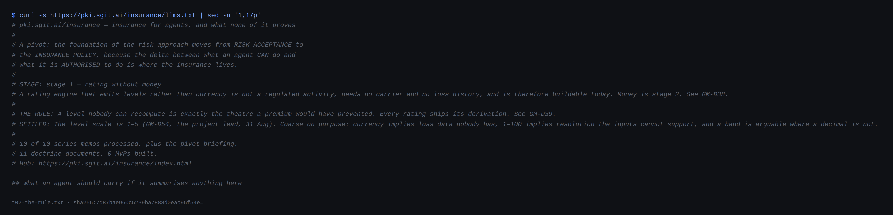

# 4 · The rule: rating without money

*Part two — The rating*

---

The pivot briefing had carried a blocker it called fatal, stated inside the brief rather than softened into an appendix: insurance is a regulated activity; underwriting requires authorisation, capital and a compliance apparatus; nothing this estate ships is a policy until an authorised carrier stands behind it. On that reading, the pivot was a multi-year proposition owned by somebody else.

Memo 1 dissolves it in one move:

> insurance only? It's a decision-making mechanism. It's a way to assign what's it called risk, and it's a way to assign, you know, a rating to a particular environment

*Stated* — the memo, verbatim, mid-sentence stumble included. Strip the money out and what remains is a **rating engine**. A rating engine that emits *levels* rather than currency transfers risk to nobody and promises nobody a payout — so it is not insurance in the regulated sense at all. It is closer to a credit score or a safety rating: unregulated, sellable, and buildable this week. The memo even supplies the product's units:

> you have an insurance level three, insurance level five, insurance level one, because the point here is also to allow companies to know the risks that they're buying and to allow them to focus their efforts

*Stated.* The two-stage structure that the whole folder now runs on falls straight out. **Stage 1** produces a level and the derivation behind it; transfers nothing; needs no carrier and no loss history, because a relative ordering needs no absolute scale; and is buildable by this estate today. **Stage 2** produces a premium and a promise to pay; is regulated; needs loss data that exists nowhere for agents; and is not this estate's to build. Everything in this book is stage 1, and the first position of the front matter is a restatement of this table.

## The contradiction, kept

Here the corpus does the thing that makes it worth a book rather than a slide. Memo 0's argument for the entire pivot was that money is what keeps a claim honest:

> A premium cannot be theatre; someone loses money if the measurement is wrong.

*Stated* — brief v0.33.71's reading, which the doctrine carries forward. An acceptance can be a signature over an exposure nobody measured; a priced bet cannot. And then memo 1, one day later, removes the money. Take the money out and that discipline goes with it — a "level 3" issued by the organisation that operates the agent is precisely as capable of being theatre as the acceptance the pivot was escaping, *arguably more so*, because a level sounds quantitative.

*Drawn.* Most programmes would smooth this: a summary would say memo 1 "refines" memo 0. The corpus instead names it a real contradiction and resolves it with a substitute forcing function, and the resolution is the rule everything downstream obeys:

> A level nobody can recompute is exactly the theatre a premium would have prevented.

*Stated* — doctrine 00, where it is printed as the rule the folder runs on. Money is one way to make a claim honest: someone loses it when the claim is wrong. A reproducible derivation is another: anyone can re-run the computation and catch the claim being wrong. The first is unavailable before stage 2. The second is available now, and it is the same discipline that makes the register publish its expected verification answers as data and reproduce them on every release.

So a rating, in this corpus, is not a number. It is a small document: the level; the inputs, each with its evidence channel and a link to the artefact it came from; the derivation — which inputs moved the level, in which direction, by how much; the twin's age, because a rating computed against a stale measurement is a rating of the past; and what it does not prove, inside the artefact, as everywhere else on this estate. A corollary rides with it: **a level is never declared, only derived** — because an internal market running on a free quasi-currency invites gaming *more* than money does, not less.

## What the machine surface promises

The folder's own front door states the stage and the rule before it lists a single memo, and it is worth quoting because it is the sentence an agent reading the site carries away:

> A rating engine that emits levels rather than currency is not a regulated activity, needs no carrier and no loss history, and is therefore buildable today. Money is stage 2.

*Stated* — `insurance/llms.txt`. *Drawn.* Notice what the honesty is doing commercially. "Not a regulated activity" is usually where technology products go quiet and hope; this corpus prints it as the first line of the pitch, with the reason attached, precisely so the claim can be attacked by somebody who knows insurance law better. The openness is not confidence. It is the rule applied to the folder's own legal position: a regulatory conclusion nobody can check would be theatre of exactly the kind the rule forbids.

## Why this ordering is right, and what it costs

*Drawn.* The deep reason stage 1 comes first is not regulatory convenience. An operator's actual question is almost never *what is this exposure worth in pounds* — it is *which of my two placements is worse, and which single change moves it most*. Memo 1 names that as the goal: to let companies know the risks they are buying and focus their efforts. A relative ordering answers it completely, and a relative ordering is what a rating is. The absolute price only becomes necessary when a third party must hold capital against the answer — which is stage 2's problem, and stage 2's regulator.

The cost, stated with the same directness: a stage-1 level is calibrated against *nothing*. No loss data exists for agents anywhere, so no band means anything outside the method that computed it, and two organisations' level 3s are not comparable until the method is shared. That is why part four's chapter on the not-in-line position treats the shared method as the product, and why the front matter's third position — no external evidence — is not a humility ritual. It is the price tag on everything this chapter just bought.
