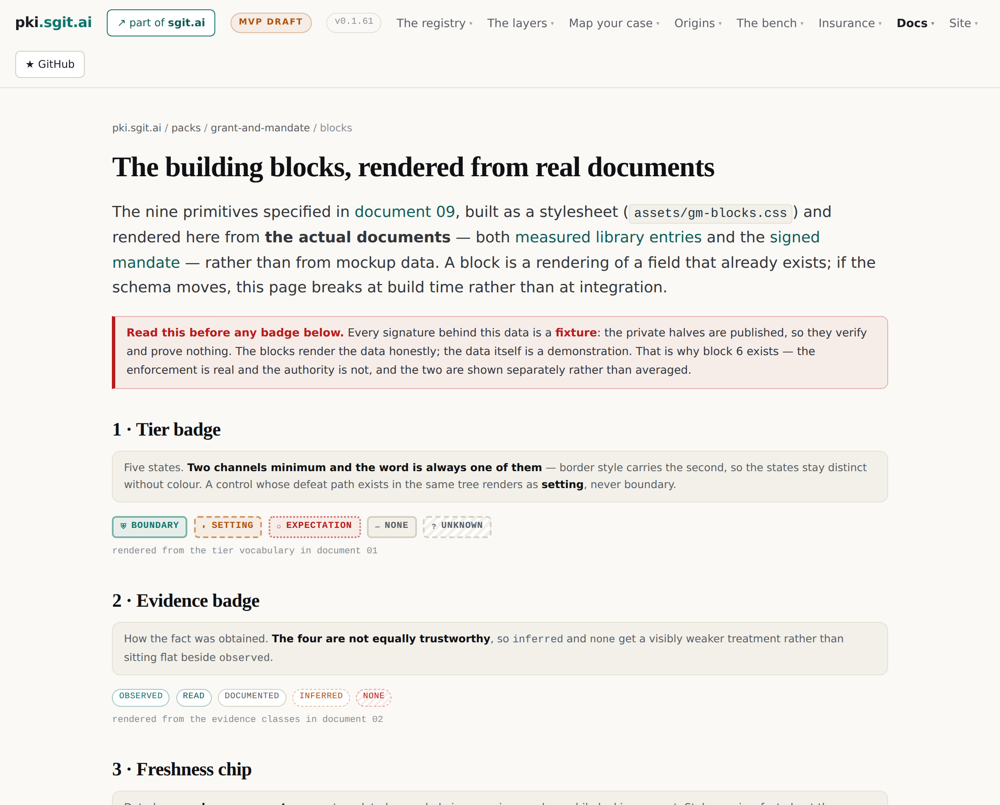

# 6 · Two channels that never merge

*Part two — The rating*

---

Memo 1 reaches for the most familiar object in personal insurance to explain where a rating's inputs come from:

> it's kind of like when you fill a questionnaire to get insurance. You know, like do you smoke? Do you do this? Like wellness insurance

*Stated* — and for agents: do you have an incident response team, a security programme, a way to contain the agent. The instinct is right, and it collides head-on with a rule this estate had already spent August defending: `library − self-report = blind spots`. **Every answer in that questionnaire is self-reported.** "Do you have a way to contain the agent," answered *yes*, is a declaration. The pre-push hook found by `measure.py` is a measurement. Averaging them launders an assertion into a number — and laundering assertions into numbers is, per chapter 3, the specific way the last market died.

So the rating runs on two channels, and the doctrine's rule is that they never merge:

> **Measured** facts — the twin, the register, computed tiers — carry full weight, and their failure mode is under-reporting: a grant is a floor, not a census. **Declared** facts — the questionnaire, the agent card — are discounted and *rendered as declared*, and their failure mode is over-reporting: nobody answers no to "do you have incident response". **Unknown** is kept as unknown, because scoring unknown as absent is the comfortable error, and it manufactures reassurance.

*Both stated* and compressed — doctrine 01 §3 carries the full table. None of this is new machinery: it is the estate's five evidence classes — observed, read, documented, inferred, none — applied to rating inputs. The questionnaire is a *declared-class fact collector*, and naming it that is what keeps it honest.

## The card, given a job

The memo says the insurance will *"promote the idea of the card"*, and the two-channel rule gives that sentence a precise meaning: **the agent card is where declared facts live.** A card is an agent's self-description — what its operator says it is, runs as, and is contained by. Under the two-channel rule the card is not a brochure; it is one whole side of the rating's input, weighted accordingly, and every claim on it becomes *checkable wherever a measurement exists to check it against*.

Which produces the quantity this chapter exists to flag, because part five will promote it to the most consequential number in the book:

> **The gap between the card and the twin is itself a rating input** — an operator who declares a containment control the twin cannot find has told you something.

*Stated* — doctrine 01. *Drawn.* At this point in the corpus the card-versus-twin gap is a *rating accuracy* device: a discrepancy worsens your level. Hold the thought. In chapter 16 the same gap returns wearing insurance's oldest and heaviest vocabulary — material non-disclosure, the thing that voids a policy rather than adjusting it — and the estate can compute it today, from two documents it already holds. No other single quantity in this corpus travels that far.

## Asymmetry as design, not accident

*Drawn.* A reader meeting "unknown is never absent" here should be warned that the corpus will appear to contradict it in part four — and that the contradiction is the design. For a **rating**, unknown must never be scored as absent, because assuming absence manufactures comfort: the placement looks safer than anyone knows it to be. For a **cover condition** — chapter 13's warranties — unknown counts as *failure*, because assuming presence manufactures liability: the insurer pays out on a backup nobody verified existed. Same three-valued facts, opposite defaults, and each default is chosen to put the cost of ignorance on the party best placed to cure it. The pair is the clearest example in this corpus of a principle that looks like a rule but is actually two rules wearing one name — and the doctrine states the asymmetry explicitly rather than letting a reader discover it as an inconsistency.

## What the connector inherits

One more consequence, recorded here because part four depends on it. The not-in-line position (chapter 14) commits this project to integrating with whatever a company already has — CMDBs, asset inventories, spreadsheets. The two-channel rule prices that promise:

> A connector labels the evidence class of everything it imports.

*Stated* — doctrine 05, GM-D57. An integration pulling from an asset inventory is producing *declared* facts unless something measures them, and a connector that flattens provenance quietly turns "integrate with what exists" into "launder what exists". Cheap to state on the first connector; expensive to retrofit onto the fifth. *Drawn.* This is the two-channel rule's most commercially annoying implication and its most necessary one: the moment the rating starts consuming customer data at scale is exactly the moment the channels are easiest to blur, and the blurring would be invisible in the output — a level is a level. Only the derivation shows the channel, which is one more reason the rule of chapter 4 makes the derivation mandatory.
