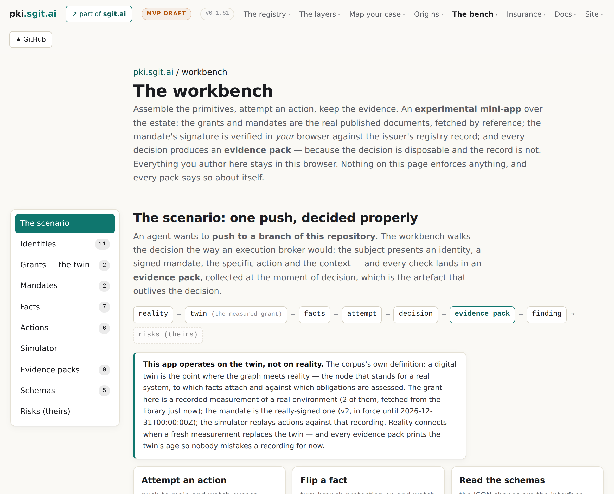

# 10 · The rating that moves

*Part three — Who pays, who rates, who backs the claim*

---

Everything to this point rates a snapshot. Memo 3's second half asks what happens on the day the world changes and the snapshot does not:

> There's a vulnerability on GitHub that allows Git, you know, any repo, any agent to now do a lot more damage on GitHub, right? Or even maybe access other GitHub accounts, right? Ultimately, it's your agent, it's the company's agent who's doing all that stuff, right? So we, you know, immediately the insurance here could change, right? It could change overnight, could change in an hour or in half an hour

*Stated* — memo 3, verbatim. The analytical move underneath is the chapter: a vulnerability lands and **the twin does not change**. The measurement recorded what it recorded; the credential still reaches what it reached. What changed is what that reach is *worth*. So the rating is a function of two things with independent lifetimes —

> **rating = f(placement twin, world state, mandate)** — and the twin and the world have **independent freshness**.

*Stated* — doctrine 03. The estate already prints twin age on every evidence pack. A moving rating needs a second age: how current is our picture of the world? A rating computed against a six-day-old twin and a three-minute-old advisory is a different object from one where both are stale, and only saying so keeps it honest.

## What it may say, and what it may not

The memo's instinct — *"has just gone 10x"* — gets the corpus's characteristic split: right instinct, wrong output. A magnitude needs loss data nobody has, and printing a multiplier would be false precision of exactly the kind the rule forbids. What is computable today is the **direction and the mechanism**: *this placement's grant now reaches repository settings, which it did not yesterday* — a named capability and a node count. *A control that was a boundary is now defeated* — a tier recomputation the workbench already performs. *Two mandate constraints are now unenforceable* — a mandate-versus-grant recomputation.

> A re-rating states what changed, which way, and which controls are implicated. Never a multiplier

*Stated* — doctrine 03, GM-D48. *Drawn.* The deeper point is who the output serves. An operator deciding whether the value still justifies the risk is better served by *your agent can now change repository visibility* than by *10x* — the first is actionable and checkable, the second is a number they cannot argue with. The moving rating keeps the rule of chapter 4 under pressure: even in an emergency, especially in an emergency, the derivation is the product.

## The loop that needs no new machinery

Memo 2 had already closed the loop in the other direction — *when you invest in a control to reduce a risk, you then are ultimately reducing the or changing the insurance premium* — and the estate's workbench already runs it: flip the branch-protection fact and the enforcement tier moves from setting to boundary, computed from the facts rather than stored. Rename the output and the mechanism is the rating's counterfactual view: *what would this control buy you here.* Two properties fall out. It is scale-free — ordering controls by how much they move a rating needs no agreed range, so the counterfactual view does not wait on band definitions. And it is the honest form of the questionnaire: chapter 6's wellness form asks *do you have a control*; the loop asks *what would this control buy you*, prospective, placement-specific, computed from that placement's own tree.

## Pulling the plug, tiered

The memo's operational endgame — *do we pull the plug, right, temporarily, or do we pull the plug for a week or a month or a day or an hour* — extends the go-live gate into a continuous obligation, evaluating on world events when nobody is asking. The far end of the mechanism already exists: a mandate is revoked by an append to the issuer's record, and the enforcement path from revocation to a refused push was demonstrated at v0.1.28. So *a rating crossing a threshold may emit a revocation* — everything except the world-state input exists.

And the tier question bites hardest exactly here:

> **a "pull the plug" that emails somebody is an expectation; one that revokes a mandate the agent's own hook honours is a setting; one the agent cannot reach is a boundary.** It declares which.

*Stated* — doctrine 03. The memo's alternative — *buy temporary cover to keep operating* — has a moneyless analogue the estate already stocks: a time-boxed exception, recorded, that expires by itself, which is simply a mandate with a short interval. *Drawn.* It says something about the design that the emergency workflow decomposes entirely into parts the register already ships — an append, an interval, a recomputation — with exactly one missing input. Which is the honest place to end the chapter:

## The hard part, named

The moving rating needs a feed of platform-affecting events, a re-rating trigger — both mechanically small — and one thing that is not small:

> **Does not exist anywhere.** Advisory feeds describe software, not capability trees

*Stated* — doctrine 03's requirements table, against the row that names the mapping from an event to the grant nodes it widens. *"This advisory widens node n4 from in-scope repositories to all repositories"* is a judgement somebody makes and records, and it is a library artefact in chapter 9's sense — made once, used by everyone. Nobody has made it, for any platform, ever. Dynamic re-rating is this corpus's most attractive promise and it rests entirely on an unbuilt dictionary; doctrine and does-not-prove both say so, and so does chapter 17.
