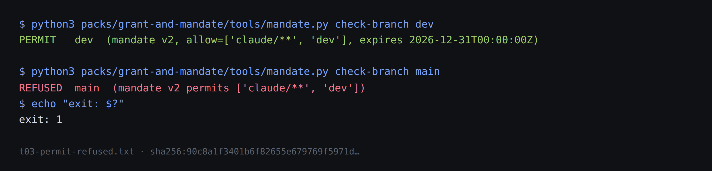

# 12 · The policy is a statement

*Part four — The machinery*

---

Part four is where the pivot stops describing a market and starts describing an implementation — and discovers, three times in three chapters, that the implementation mostly exists. Memo 7 begins it:

> a policy becomes something that can sign something. So you. So what's cool about this is you can now, for example, say, hey, I'm only going to give you the data if you have a particular policy from an entity that I trust

*Stated* — memo 7, verbatim. The doctrine untangles the two mechanisms hiding in that sentence, and the untangling is the design. First: what *is* a policy, as a document? The register already holds statements with an issuer, a subject, a scope, an interval, a revocation path and a signature — mandates. Lay a policy beside one and the rows line up: who authorised becomes who rated; capability-on-resource becomes the level and what it is contingent on; valid-from-until becomes the cover period; revocation is an append to the issuer's record in both.

> policy/v0 is a mandate-shaped statement issued by a rater rather than an operator

*Stated* — doctrine 07, GM-D62. One more statement type beside identity, mandate, acceptance, revocation and grant — **no new register machinery**, and the record pages would render it the day it existed.

## A policy never signs

The second mechanism is the one the memo's phrasing blurred, and the corpus had pre-paid for the clarification eleven days earlier:

> A signature proves possession of a private key and proves nothing about trustworthiness.

*Stated* — the estate's own line of 19 August, before any insurance work existed, re-verified verbatim by the audit. A **holder** signs a request, proving possession of the private half of the identity the policy names as subject. The **policy** is signed by its issuer and never signs anything: a key signs; the policy establishes what that signature is *worth*. Conflating the two would have produced a confused object — a certificate that acts — and the estate's oldest discipline is what prevented it.

So the handshake is three checks, all of which the register already answers: is this the subject (the signature verifies against the published key); is a policy in force for that subject (a statement with an interval and no revoking append); does its issuer mean anything to me (the relying party's own root decision — which the register deliberately makes for nobody).

## The boundary, found

Chapter 14 will record the position this pivot accepted early: a party outside the line cannot enforce, so this project can never itself be a boundary. Memo 7 resolves the resulting question — *then who can?* — and the resolution is the pivot's structural high point:

> I'm only going to give you the data if you have a policy

*Stated.* The check lives in the **relying party** — the system being asked — and a relying party is *by construction* outside the requesting agent's grant. It holds the data; the agent cannot reach in and disable its check.

> **The policy handshake is the first mechanism in this pivot that can reach tier `boundary`** — and it gets there without this project standing in the line, because the enforcement point is the counterparty

*Stated* — doctrine 07, GM-D64. With its condition attached, because a tier is always a property of a relationship: it is a boundary only where the relying party is genuinely independent of the requester. An internal service enforcing a check on an agent run by the same team, on infrastructure that team administers, is back to a setting. *Drawn.* The condition is not fine print; it is the whole chapter in one sentence. Enforcement strength is not a feature a product ships — it is a fact about who controls what, and the handshake's brilliance is that it recruits the one party whose incentives and position already face the right way.

## Revocation is bounded by attention

The memo wants dynamic revocation — a zero day lands and *within 10 minutes or within an hour, we will revoke access to the policy*. The corpus had, again, already priced the promise, in an observability brief from 20 August:

> revocation propagates only at the rate relying parties check, which makes the interval between a party's checks its effective revocation latency

*Stated* — re-verified by the audit at its claimed date. A policy promising ten-minute revocation delivers ten minutes only to parties who check that often; to a party caching for a day it is a one-day promise wearing a ten-minute label. So *a revocation SLA states the required check interval, or it is a hope with a number on it* — and the handshake turns out to be the fix as well as the feature: a relying party verifying on every request has a revocation latency of one request, the shortest achievable. The doctrine notes the memo did not make that argument for its own design, and makes it: the handshake is not only how you check — it is what makes fast revocation mean anything.

## Metering the check, and the three hazards

The memo spots a business model in the verification step — the provider learns how often a policy is used, and can charge for the check. The corpus's three-part reply is the estate's observability doctrine doing exactly what doctrine is for. A verification is not a use — the metric is a verification graph, and the most valuable signal in it is the silent case: parties holding a policy who have never once checked it. Metering means the provider learns who checks what, when — and the estate had already settled where such events belong: written by the checker into the issuer's own lane, an owner observing their own asset, never a central log accumulating who evaluates whom across parties that never consented. And pricing the check taxes the behaviour the system most wants — rational relying parties would cache, batch and skip, raising the very latency the handshake exists to lower:

> A per-verification price is a tax on the behaviour the system most wants

*Stated* — doctrine 07, GM-D65. Price by seat, policy or period instead. *Drawn.* Three memos of part four, and each lands on the same shape: the insurance layer keeps proposing things the estate's pre-insurance doctrine already had opinions about, and the opinions hold. That is either a corpus exhibiting suspicious self-consistency or a design that was, in fact, converging — chapter 17 gives the audit's evidence for the second reading.

## Who checks first

The operating-licence pattern — *without that, we cannot operate* — is culturally legible to a business in a way no security score is: regulated firms cannot trade uninsured; contractors cannot start without certificates. The hard part is not the mechanism but the first mover, and the doctrine's honest table gives it: internal services, whose organisation can simply set the rule — the internal marketplace with the handshake as its enforcement, needing nobody else's cooperation; then brokers, out of self-protection, since their own policy is exposed to what they let through; external platforms not yet, because no incentive exists. Nothing has adopted it. Doctrine 07's does-not-prove says so, and the pattern needs an adopter before it is a pattern.
