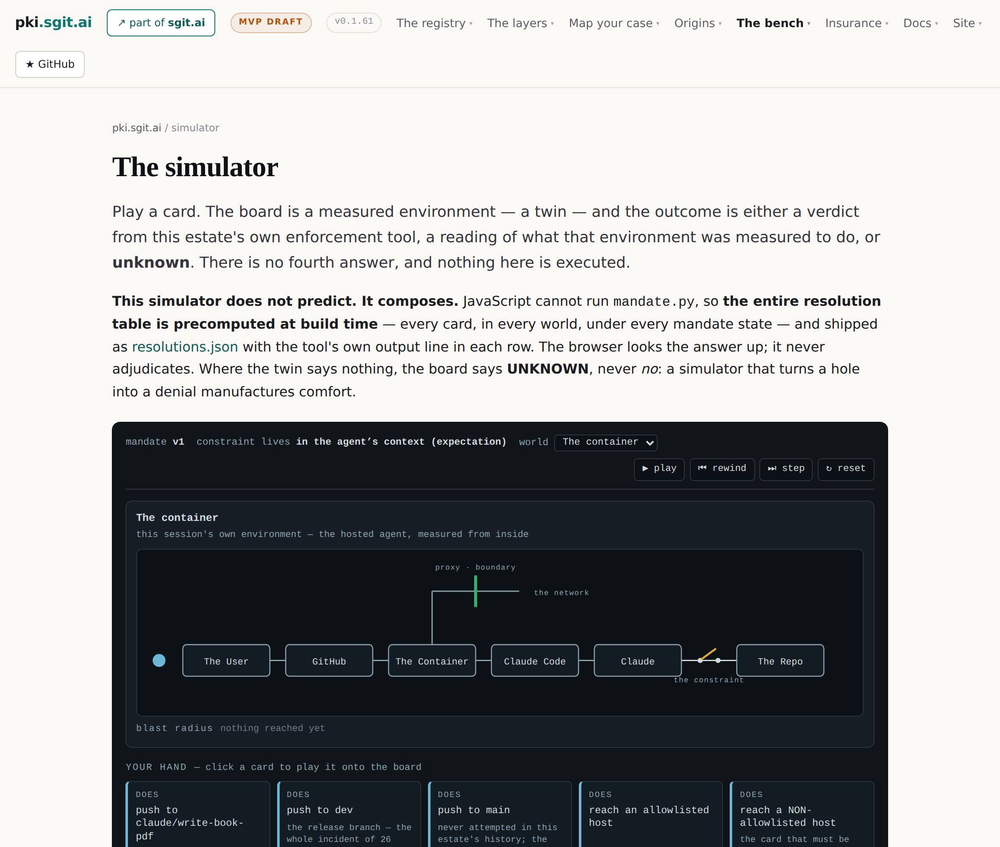

# 15 · The world model

*Part five — The proof and its absence*

---

By the eighth memo the site agent processing this series had proposed the same MVP four releases running: a placement rated 1–5 with its derivation, plus a which-control-buys-the-most view. Memo 8 turns it down, and gives the reason twice — *users is going to be the first important thing*, and:

> we need to now create this sort of gamification, this sort of environment, this sort of game we have that fundamentally allow us to simulate this

*Stated* — memo 8, verbatim, and the purpose arrives a minute later in the same transcript — *"ultimately that's what we can use to explain this"* — in the register the memo itself proposes: somewhere between Monkey Island, Minecraft and SimCity — places a person moves between, assets visibly moving, missions, some sequences replayed and others connected live. The doctrine compresses the correction into the distinction this chapter turns on:

> An instrument answers a question somebody already knows how to ask. An explainer creates the person who can ask it.

*Stated* — doctrine 08, GM-D67. Nobody currently holds a mental model of grant-minus-mandate priced as insurance, so a rating engine has no audience yet; building it first would be building the second thing first. The rating still exists underneath — as the thing the world demonstrates rather than the thing that ships. And the reframe indicts the estate's own inventory on the way past: the simulator, the experiments and the workbench are instruments, excellent ones, for somebody who already has the vocabulary. **This estate has instruments and a card game. It has no world.**

## What stage 1 needs from assets, and what it refuses

The memo binds cost to assets — time, money, recoverability, liability — and the doctrine keeps the boundary chapter 3 drew: valuing assets is outside this estate's competence. The reconciliation is clean enough to state as arithmetic: **a level is relative; ranking two placements needs no absolute value; pricing one does.** So stage 1 needs asset **class** — production or not, personal data or not, customer-facing or not: a declared fact, marked as such — and does not need asset **value**, which is stage 2's problem and somebody else's data. The four dimensions are recorded now anyway, as the columns a future valuation would fill, because naming them stops a resource count being mistaken for a cost.

Three actors join the twins, under rules already in force: the **underwriter**, an identity issuing policy statements; the **insurer**, absent in stage 1 by construction *and shown as absent rather than greyed-in as though pending*; and the **claim** — `loss-event/v0`, still undrafted, the one primitive the whole pivot lacks, exactly where chapter 1 left it. Each declares fixture-or-real like every identity here: an underwriter in a demonstration whose private half is published is not an underwriter, it is a fixture, and the world says so as prominently as the record pages do.

## The rule that keeps it honest

Then the load-bearing requirement, the one this book regards as part five's contribution to the whole corpus and not just to the MVP:

> A polished simulation is the most effective mechanism yet devised for making a demonstration look like a product.

*Stated* — doctrine 08. A world with departments and data visibly flying between them implies a working system — smooth, populated, confident. Of everything this estate would depict: ten of eleven register identities are fixtures with published private keys; both twins are servers and nobody has measured a desktop agent; the claim shape does not exist; the world-state feed exists nowhere for anybody; no insurer, underwriter or relying party has ever been implemented. A rendered world is a continuous, wordless claim about how much of this exists — apparent authority arriving in the user interface. So:

> unmeasured places look unmeasured. Fixture identities look like fixtures. Mechanisms that do not exist are visibly absent, not smoothly rendered.

*Stated* — GM-D69. A player sees which parts of the city are built and which are drawn, without reading a caveat. The doctrine's better sentence is the aesthetic one: **a city with construction sites and empty lots explains where this work actually stands better than a finished skyline does** — and it makes the roadmap part of the fiction rather than a footnote under it.

## 2D first, and the walkthrough

One disagreement with the memo is preserved, labelled, and defended as engineering sequencing rather than smuggled in as interpretation: the memo asks for 3D, and the doctrine argues most of the explanatory value is spatial rather than dimensional — places, actors, things moving along edges all work in 2D, which this estate already draws by hand in SVG with no third-party requests. A 2D world tests whether the explanation lands, which is the whole risk, at low cost; 3D tests whether immersion adds to an explanation that already works, at high and irreversible cost. **Build the 2D world first.** A 3D world that explains badly is expensive to discover and expensive to abandon. The audit singled this handling out — the site agent's advice, carried into does-not-prove rather than blended into the memo's position — as the disagreement done correctly.

The MVP, then, as specified: a 2D world walking one worked example end to end. Places are the actors — the environment where the twin is measured, the operator, the underwriter, the relying party, and an empty lot marked *insurer — stage 2*. Moving things are documents the estate already publishes: a grant, a mandate, the delta, a policy statement, a verification. The walkthrough runs: measure the environment → see the grant → read the mandate → watch the delta appear → get it rated → install a control and watch the level move → a zero day lands and the level moves again → the policy is revoked → the relying party refuses. Every step is a document or a computation the estate already has, except two — the claim, and the world-state feed — and those appear as construction sites.

*Drawn.* This book cannot help noticing that it is itself the object the memo warned about: a coherent narrative is a polished rendering of a mostly unbuilt thing. The defence is the same as the world's — the emptiness is shown. Chapter 17 is this book's construction-site district, and it is the longest chapter in part five by design. Nothing in this chapter is built either; the world model is a specification with a rule attached, the rule is the best part, and the first thing that will be argued away when somebody wants to impress a room is the empty lots. The doctrine says that last sentence about its own rule. It is probably right, and writing it down is the only defence anyone has invented.
