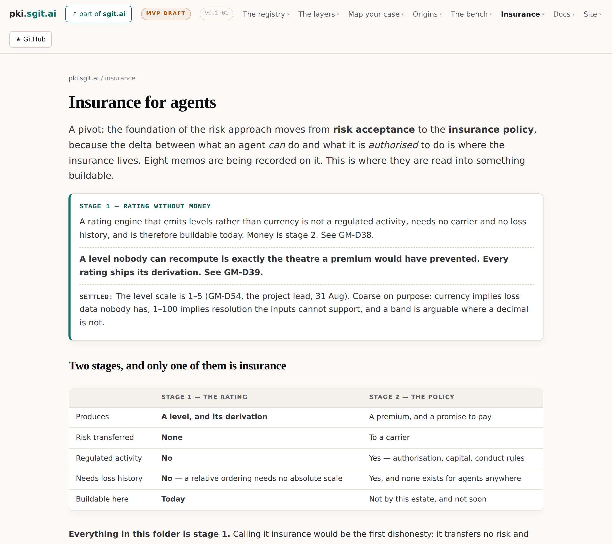
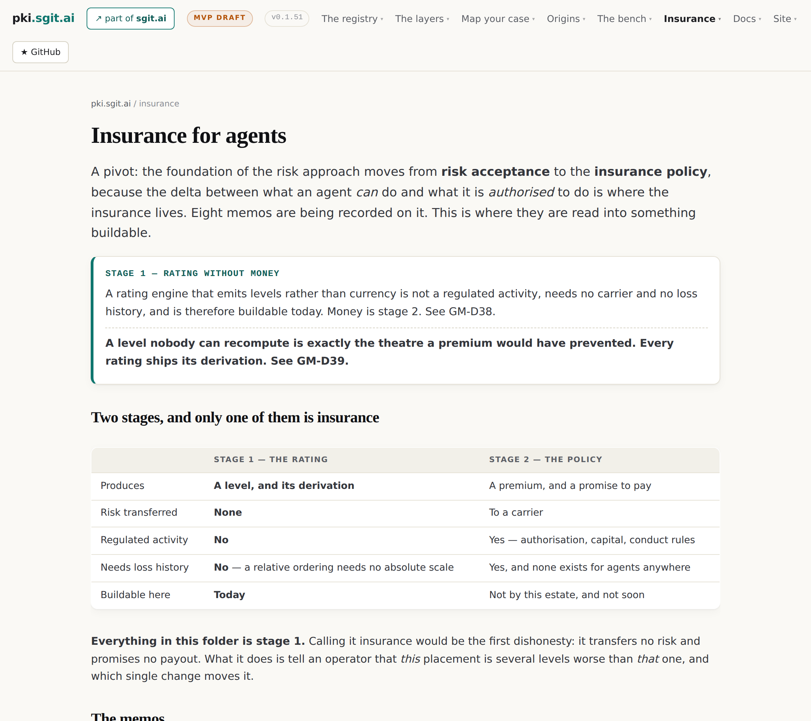

# 17 · What none of this proves

*Part five — The proof and its absence*

---

This chapter is the book's construction-site district: the accounting of what the corpus does not prove, what it got wrong about itself, and what the numbers actually are. Its counts are computed at build time from the repository, because the defect this chapter spends most of its length on is what happens when they are typed.

## The state of the work, in computed numbers

The series stands at <!-- gen:stat:memos -->10<!-- /gen:stat:memos --> memos plus the pivot briefing, read into <!-- gen:stat:doctrine -->11<!-- /gen:stat:doctrine --> doctrine documents. The pivot has proposed <!-- gen:stat:decisions_pivot -->51<!-- /gen:stat:decisions_pivot --> decisions onto a change-control log that now holds <!-- gen:stat:decisions_total -->85<!-- /gen:stat:decisions_total --> — and of the pivot's decisions, exactly one is settled: the 1–5 scale. The insurance folder's own machine surface carries <!-- gen:stat:dnp -->20<!-- /gen:stat:dnp --> does-not-prove entries, which this book has distributed across sixteen chapters rather than quarantined in one. The register the rating would read holds <!-- gen:stat:records -->11<!-- /gen:stat:records --> records, <!-- gen:stat:fixtures -->10<!-- /gen:stat:fixtures --> of them fixtures with published private keys. The excess-authority view still shows a grant of <!-- gen:stat:grant_resources -->41<!-- /gen:stat:grant_resources --> resources against a mandate of <!-- gen:stat:mandate_resources -->1<!-- /gen:stat:mandate_resources --> — an excess of <!-- gen:stat:excess_resources -->40<!-- /gen:stat:excess_resources -->, acceptor still null. The insurance arc ran from v0.1.50 to v0.1.60 — <!-- gen:stat:arc_releases -->11<!-- /gen:stat:arc_releases --> releases in <!-- gen:stat:arc_hours -->5.1<!-- /gen:stat:arc_hours --> hours — inside an estate that has now cut <!-- gen:stat:releases -->60<!-- /gen:stat:releases --> releases in total. And the number that outranks all of these: **zero MVPs built, zero external facts gathered.**

## The audit: six defects, and what they teach

Every one of the eleven readings was re-read against the transcript it came from, at v0.33.82, before this book was written. The verdict first, because it is the part a summary drops: the interpretation held. The two-stage split is real; the three-brokers disambiguation was caught; the Fibonacci repair saved a settled decision from a good instinct; all four load-bearing corpus quotations verify verbatim at their claimed dates. What did not hold was the arithmetic and the housekeeping — <!-- gen:stat:audit_defects -->6<!-- /gen:stat:audit_defects --> defects:

**Three stale counts.** Doctrine documents said *eight memos* after there were ten, said *memo N of 8* in their footers, and twice called memo 8 *the last of the series* while memos 9 and 10 sat in the folder beside it. The pattern behind all three is the one this estate keeps re-learning: a number typed into prose by a writer who knew it, in a folder whose own rule is that a claim must be checkable. The fix was not the three edits — it was a build gate, which then caught real text on its first run and was kept rather than loosened.

The pair of figures above is this defect made visible. The hub at v0.1.51, preserved at its tag, believed the series was eight; the hub today computes its count from the manifest because believing turned out to be the wrong verb.

**One claim identified with the wrong quantity.** The doctrine had equated the enforcement tier with impact reduction — the quantity memo 4 asked for. The audit narrowed it: the tier ranks reachability, which is blast-radius reduction, an adjacent quantity and not the same one. Chapter 3 carries the corrected version; the uncorrected one would have credited a boundary control for post-incident recovery it has nothing to do with.

**One over-claim.** Stage 1 was called immune to moral hazard because it has no payout. Chapter 8 carries the correction: removing the payout removes one channel and opens another — the badge. Immunity claims are exactly the over-statements this corpus exists to refuse, and it briefly made one about itself.

**One dropped question.** Memo 3's model-vendor question — would Claude carry a policy on its own mistakes — was flagged when the memo was read and then never landed in doctrine, until the audit put it in chapter 9's place in the argument. A forward reference that does not land is the same defect as a count that does not add up.

*Drawn.* What the six defects have in common is that none of them is an interpretation failure. The method — transcripts filed before reading, doctrine naming its memo, corrections recorded in both documents — held under audit. What failed was everything the method did not yet mechanise: counts, footers, promised cross-references. The estate's response was to mechanise them. This book's response is this chapter's markers, every one generated.

## What nothing here proves, aggregated

The chapters have carried these individually; assembled, they are the honest silhouette of the whole pivot. Nothing proves that **any of this is insurance** — stage 1's whole design is that it is not. Nothing proves **the placement orderings** — the estate cannot measure its own leading example. Nothing proves **a level means the same thing twice** — no calibration without loss data, and no loss data exists. Nothing proves **aggregation works** — correlation is named as a graph problem and unimplemented. Nothing proves **the delta classes can be told apart automatically** — the platform-granularity library does not exist, so today the classification is a judgement. Nothing proves **dynamic re-rating is close** — the event-to-grant-node mapping exists nowhere, for anybody. Nothing proves **the handshake is a boundary anywhere today** — it reaches that tier only under an independence condition nothing has tested. Nothing proves **a world explains better than a document** — the memo's hypothesis and the site agent's agreement are two opinions, not evidence. Nothing proves **the survey's answers** — and the corpus published its one prediction in falsifiable form rather than as a finding. And nothing proves **the estate's own measurement is complete** — memo 3 found a grant node the tool misses, by conversation rather than by tooling, and the honest reading is that there are others.

*Drawn.* The front matter promised that several of these positions *are* the argument, and this is where the promise cashes out. A rating whose first product is a checkable derivation only matters in a world where most assessments cannot be checked; a corpus that publishes twenty ways it might be wrong is only interesting if the twenty are specific, dated, and wired to gates that fire. The alternative posture — confidence, in the standard idiom of product announcements — was available at every step and would have been cheaper. The bet this book documents is that in a market whose last iteration died of unfalsifiable numbers, the auditable posture is not the ethical alternative to the commercial one. It is the commercial one.
