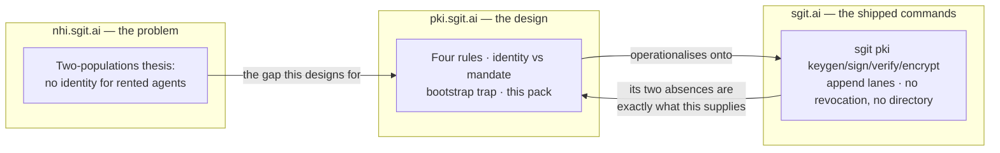
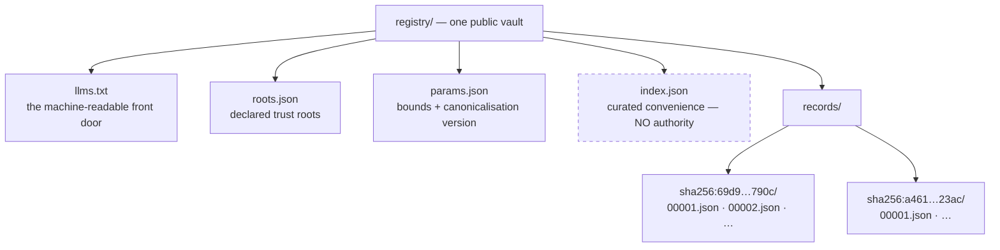
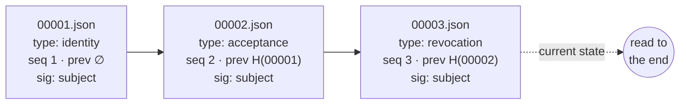
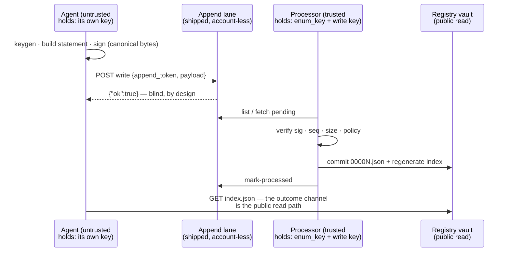
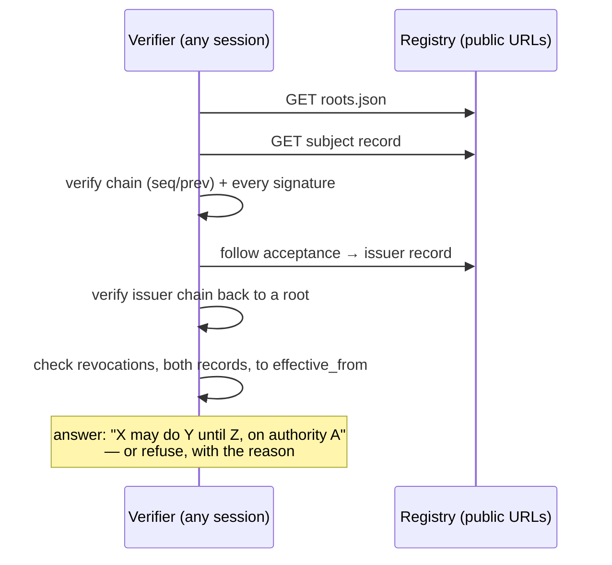
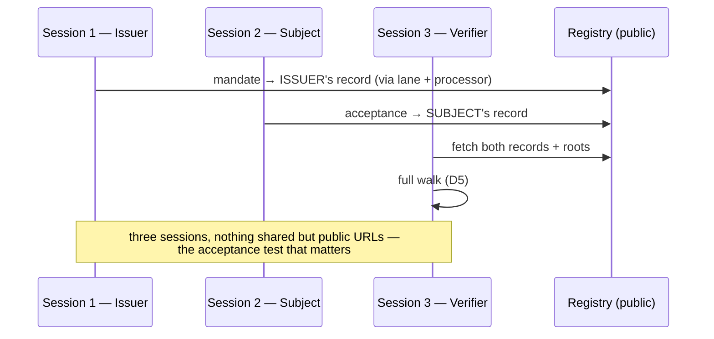
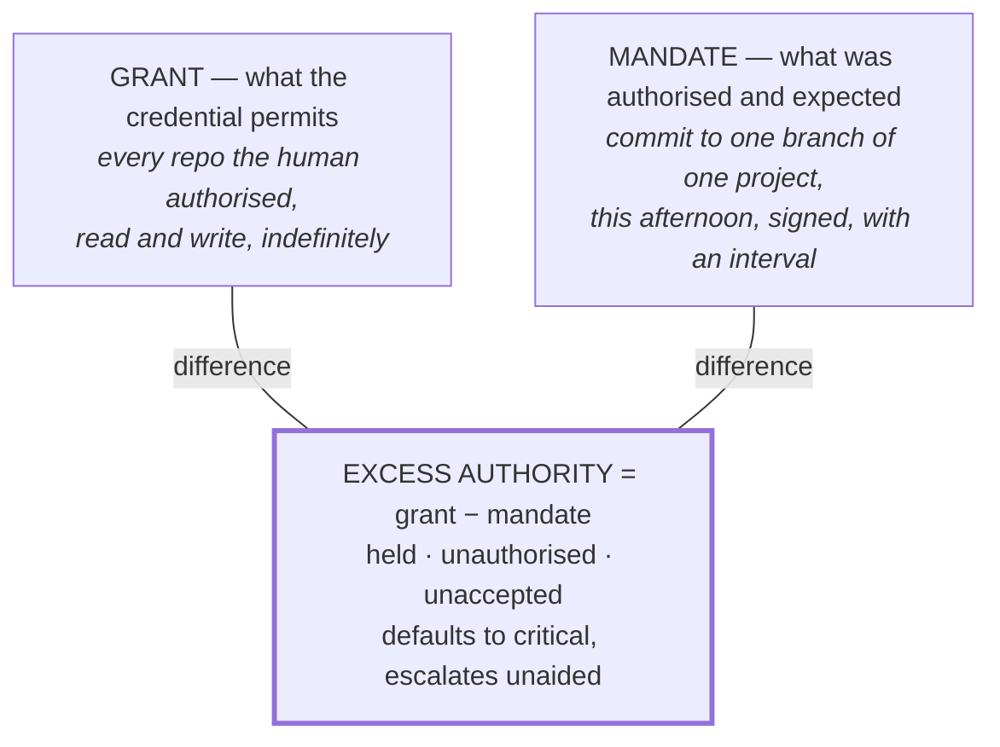
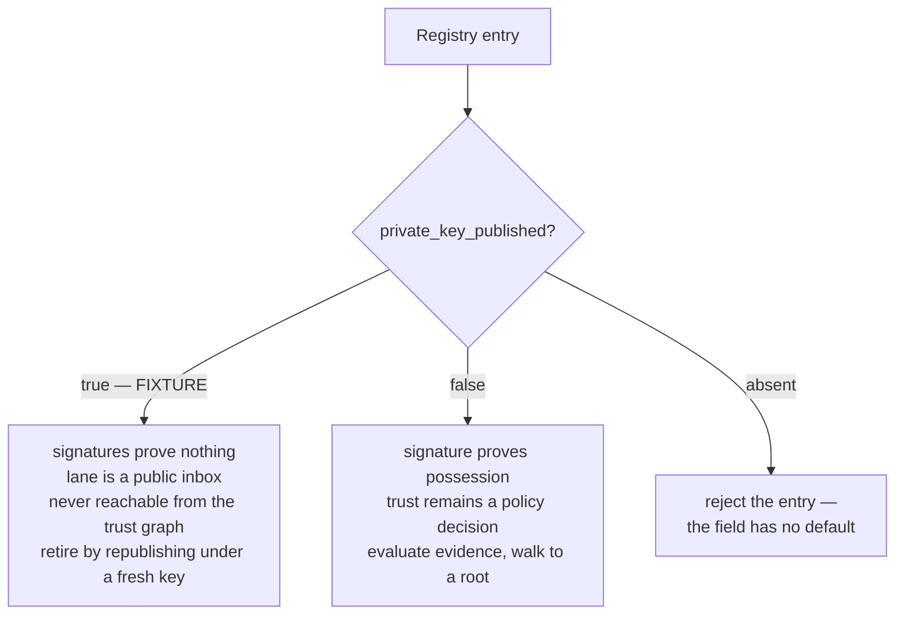

# 05 — Diagrams

**pack** Registry MVP · draft-1 · 20 August 2026
**role** The design as pictures: the estate, the record, the write path, the verification walk, the three-session demo, and the grant/mandate gap. Each diagram states what it claims and which pack document it comes from.

---

## D1 — Three sites, three thirds of one answer

From the v0.33.61 site access report: the composition the registry sits inside. The report's finding is that these cross-link only at the domain level; the pack's read-path phase is where page-level joins land.

## D2 — The registry tree (from 01)

## D3 — A record is a hash chain (from 01)

Claim: a mirror cannot drop a middle statement without the chain failing, and current state is read-to-the-end.

## D4 — The write path (from 01, transport from the shipped surface)

## D5 — The verification walk (from 02)

## D6 — The three-session demo (from 04, phase 4)

## D7 — Grant, mandate, excess authority (from v0.33.61, folded in via 06)

Claim: the registry records all three sides, which is what makes the gap countable.

## D8 — Fixture or identity? (from v0.33.61, folded in via 06)

Claim: the `private_key_published` flag must be read **before** the signature, because a fixture's signatures verify and prove nothing.

---

*Added after publication, 20 August 2026 (site v0.1.12). No claim above has been changed — this pack supersedes rather than rewrites; the only edit was moving the licence line below this block so it stays last. Later documents that bear on this one:*

- `08__ux-mockups.md` — the same objects as screens rather than structures — what a reader actually sees when D5's walk resolves, or refuses
- `09__wardley-maps.md` — the strategic counterpart: these diagrams say what shape the design is, the maps say where each piece sits and how evolved it is
- `10__user-stories-and-features.md` — a mandate lifecycle state diagram, which is the one shape this document does not carry

---

This document is released under the Creative Commons Attribution 4.0 International licence (CC BY 4.0).
