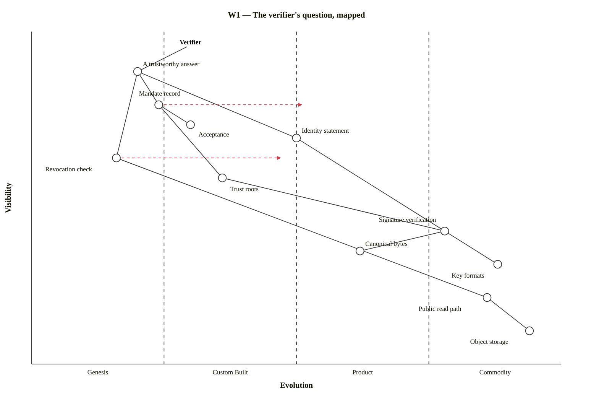
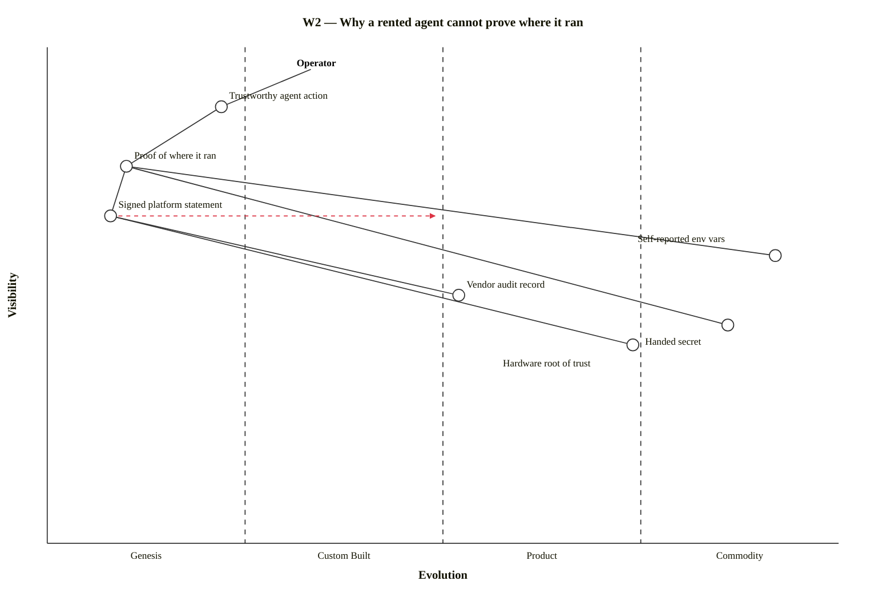
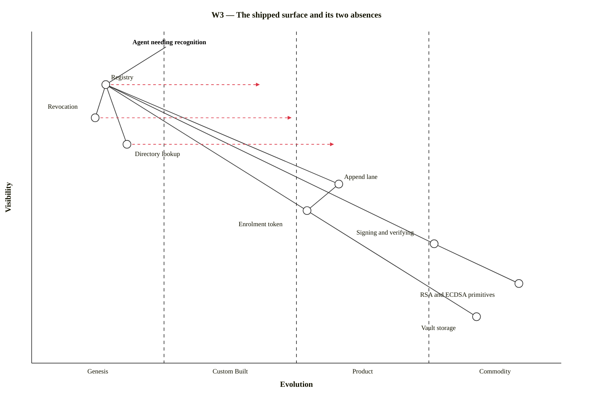
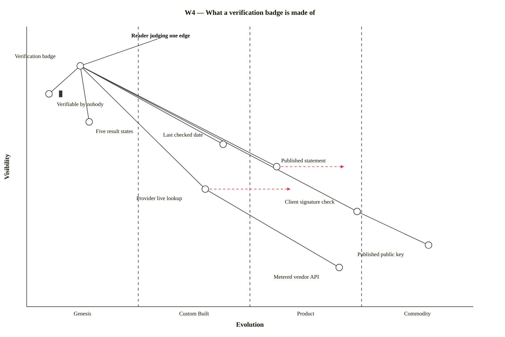

# Six Wardley Maps Of The Registry: The Verifier's Question, The Rented Agent's Missing Anchor, And Why A Policy Is Worth Exactly What Its Weakest Badge Is Worth

**version** draft-1 (site-agent first pass — corpus version to be assigned on adoption)
**date** 20 August 2026
**from** The site agent
**to** Project lead, Engineering, Architecture, Strategy

**type** Strategy brief — maps

*Tenth document of the registry MVP pack. Six Wardley maps of what this pack is building, drawn in mermaid's `wardley-beta` diagram type so they live in the source rather than beside it. Each map states the user need it starts from, the claim it makes, and what would move a component if the claim is wrong — a map that cannot be argued with is a picture. Limitation: positions on the evolution axis are judgements, not measurements; they are stated so they can be disputed, and the disputable ones are named under each map.*

---

## What This Is

The pack's argument, mapped. Documents 01–04 give a design; document 05 gives its structure as diagrams; this one asks the different question a map asks: **given a user with a need, what does that need depend on, and how evolved is each of those dependencies?** It matters here because the pack's central claim is a claim about position — that the registry supplies two things the shipped surface does not have, and that everything underneath those two things is already commodity.

**A note on the drawing method, because it is a first for this estate.** sgit.ai's own strategy maps are hand-drawn inline SVG — a deliberate choice made when the maps were authored, and the right one at the time. Mermaid has since shipped Wardley maps as a first-class diagram type, `wardley-beta`, and this document is the estate's first use of it. The advantage is that the map is now text in the source file: reviewable in a diff, correctable in a pull request, and — because it renders through the same `mermaid@11` module every other diagram on this site uses — carried by machinery that already exists. The cost is stated under honest tensions; `beta` is in the name for a reason.

## How To Read These

```
   Y axis, "visibility"   how close a component sits to the user's need.
                          Top = the user touches it. Bottom = plumbing.

   X axis, "evolution"    Genesis → Custom Built → Product → Commodity.
                          Left = novel, uncertain, hand-made, expensive to
                          get wrong. Right = ubiquitous, well understood,
                          boring, cheap.

   ─ ─ ─►                 an "evolve" arrow: where this pack expects the
                          component to move, not where it is.

   ▮                      inertia: something that resists moving, usually
                          because a decision or a sunk investment holds it.
```

Two reading rules the corpus already implies. **Nothing left of "Product" should be bought**, and nothing right of it should be built. And **a dependency more genesis-shaped than the thing depending on it is a risk**, because the thing on top cannot be more reliable than what holds it up.

## W1 — The Verifier's Question

**User need:** a third party who must answer *may this agent do this?* holding nothing but public URLs.



**The claim.** Everything below the halfway line is commodity or near it — object storage, a public read path, canonical byte recipes, signature verification with shipped commands, published key formats. The registry adds nothing there and should add nothing there. **All of the novelty in this design sits in the top-left quadrant**, in four components: a trustworthy answer, the mandate record that supports it, the acceptance that closes it, and the revocation check that dates it.

**What this argues for.** The pack's build order (document 04) is read-path-first, and the map says why that is cheap: the read path is a walk over commodity. The expensive, uncertain work is the four objects, and those are schema decisions, not engineering ones — which is why document 02 asks for review rather than for a sprint.

**What would move things.** If mandate records became a product anyone could adopt off the shelf — a standard schema with implementations — the whole top-left collapses rightward and this pack's job becomes integration rather than design. The `evolve` arrows say the site agent expects exactly that within a few years, and expects it to happen to *someone else's* schema unless something is published.

**Disputable.** "Canonical bytes" at 0.62 is generous. Canonicalisation is a well-understood problem with a long history of subtle failures, and placing it at Product rather than Custom Built assumes `jq -cS` plus a versioned recipe is settled. Document 01 versions it in `params.json` precisely because it is not as settled as this position implies.

## W2 — Why A Rented Agent Cannot Prove Where It Ran

**User need:** an operator who wants a trustworthy account of what an agent did, including where it ran.



**The claim, and it is the two-populations thesis in map form.** For agents you *run*, the chain terminates in a hardware root of trust sitting at Commodity — a TPM is a boring, ubiquitous component. For agents you *rent*, that anchor is not reachable, and the chain terminates instead in `Self-reported env vars`: a component drawn far right because environment variables are as commodity as computing gets, and drawn with inertia because that is exactly the problem. **A commodity component in the wrong place is still the wrong component.** It is cheap, universal, and worth nothing as evidence, because it is asserted by the same software stack whose integrity is in question.

**The refutation of the obvious fix, drawn.** `Handed secret` sits at 0.86 — near commodity, because issuing a session a secret is trivially easy — and it hangs off the need for proof-of-location while being incapable of supplying it. A secret proves possession, not location. Its position on this map is the whole argument against it: the easiest available answer, in the wrong place on the value chain, answering a different question.

**The tractable finding.** `Vendor audit record` sits at 0.52 rather than at Genesis, and that placement is this map's most useful assertion: **the fact already exists.** A vendor does record which surface a session ran on. What is missing is at 0.08 — a signed statement about that record, issued to a named third party. Attestation from nothing is a hardware problem. Signing a record you already hold is a product decision, and product decisions move.

**Disputable.** The `evolve` arrow on `Signed platform statement` reaching 0.50 is a bet on vendor incentive, not on technology. Nothing about it is hard. Whether anyone ships it depends on whether relying parties ask, which is the argument for asking in public.

## W3 — The Shipped Surface And Its Two Absences

**User need:** an agent that needs to be recognised by a project it has no prior relationship with.



**The claim.** The shipped estate's own words are that it has no revocation and no directory. This map says what that sentence costs. The cryptographic primitives sit at Commodity, signing and verifying at 0.76, the append lane at 0.58 — a genuinely useful, genuinely novel account-less write path. And then the two absences sit at 0.12 and 0.18, in Genesis, holding up the entire thing the user actually needs.

**This is the pack's reason to exist, drawn in one picture.** Every component that could be bought has been. What remains unbuilt is not underneath — it is on top, closest to the need, and least evolved. The registry is not an addition to the shipped surface; it is the two missing components at the top of its value chain.

**What would move things.** All three `evolve` arrows point rightward into Custom Built, which is a deliberately modest claim: this pack does not expect the registry to become a product. It expects it to become *somebody's working custom thing*, published, so the next person does not start at Genesis. The MVP's whole ambition is to move three components one stage.

**Disputable.** `Append lane` at 0.58 may be too far right. It is shipped and it works, but it is shipped in one implementation, on one platform, with a token distribution story that is still out-of-band. One implementation is not Product.

## W4 — What A Verification Badge Is Made Of

**User need:** a reader deciding whether to believe one line on a page.



**The claim.** The badge itself is Genesis — nobody ships this — but five of its six inputs are not. Signature checking against a published key is commodity. A published statement is a file on a web server. Only two components are genuinely novel: the badge as a composed object, and `Verifiable by nobody` as a renderable value.

**`Verifiable by nobody` is drawn at 0.05 with inertia, and both are deliberate.** It is the most genesis-shaped component on the map because no existing interface renders it — every trust UI in production shows a tick, a cross, or a blank. And it carries inertia because the pressure against it is not technical: an interface that admits what it cannot check looks worse than one that does not, and that pressure will not evolve away. It is the component most likely to be quietly dropped in implementation, which is why it is worth drawing.

**The cost asymmetry is the design's economics.** `Client signature check` sits at 0.74 with a commodity dependency and costs nothing per check. `Provider live lookup` sits at 0.40 with a metered dependency and costs money per check, per relying party, forever. The evolve arrow on it is optimistic and the map should be read sceptically there: metered APIs evolve toward Product for the vendor, not toward cheap for the caller.

**Disputable.** `Five result states` at 0.14 treats a distinction as an invention. It is not new — every mature monitoring system distinguishes down from unknown. What is new is applying it to *trust* claims, where two-state thinking is entrenched. A reviewer could reasonably move this to 0.35.

## W5 — A Policy Is Only As Strong As The Badge Beneath It

**User need:** a policy owner who wants to state a rule and know whether it is being kept.

```mermaid
wardley-beta
title W5 — A policy is only as strong as the badge beneath it
anchor Policy owner [0.96, 0.30]
component Policy verdict [0.88, 0.18]
component Saved query returning no rows [0.76, 0.30]
component Register graph [0.64, 0.22] label [-96, -14]
component Edge badge [0.54, 0.12]
component Enforcement [0.44, 0.34]
component Instrumentation [0.34, 0.08] inertia
component Query engine [0.24, 0.72] label [-84, 20]
component Graph storage [0.12, 0.88] label [-90, 20]
Policy owner->Policy verdict
Policy verdict->Saved query returning no rows
Saved query returning no rows->Register graph
Saved query returning no rows->Query engine
Register graph->Edge badge
Register graph->Graph storage
Edge badge->Enforcement
Edge badge->Instrumentation
evolve Edge badge 0.40
```

**The claim.** A policy verdict is a high-visibility, genesis-shaped thing sitting on top of a saved query, a graph, and — critically — an edge badge at 0.12. The two components hanging off that badge are `Enforcement` and `Instrumentation`, and which one a given policy *is* is decided entirely by the badge's `verifiable by` field. **The same query, over the same graph, is a control or a wish depending on one component two layers down.**

**Why the map is more useful here than the prose.** Written out, "a policy is only as good as its evidence" is a truism nobody disputes and everybody ships around. Drawn, it is a structural dependency: the verdict at 0.88 cannot be more solid than the badge at 0.12, and a policy dashboard that reports green without reporting the badge is displaying the top of a chain while hiding its bottom.

**`Instrumentation` carries inertia** for the same reason `Verifiable by nobody` does. A policy that detects nothing still produces a report, the report still says compliant, and nothing in the normal operation of the system ever surfaces the difference. That is the definition of a component that will not move on its own.

**Disputable.** `Query engine` at 0.72 assumes the register stays small enough for a general-purpose query engine to be an off-the-shelf choice. At the scale the pack designs for — one operator, a handful of agents — that is fine. It is the position most likely to be wrong later, and the one it costs least to be wrong about.

## W6 — The Build Order As Movement

**User need:** a fresh LLM session holding nothing but public URLs, expected to complete the loop.

```mermaid
wardley-beta
title W6 — The build order as movement
anchor A fresh session with only public URLs [0.96, 0.26]
component Three-session demo [0.88, 0.06]
component Mandates and grants [0.76, 0.10]
component Write path [0.62, 0.22]
component Read path [0.48, 0.34]
component Fixtures [0.36, 0.16] inertia
component Validator in CI [0.28, 0.60] label [-98, 20]
component Published URLs [0.16, 0.90] label [-102, 20]
A fresh session with only public URLs->Three-session demo
Three-session demo->Mandates and grants
Mandates and grants->Write path
Write path->Read path
Read path->Fixtures
Read path->Published URLs
Read path->Validator in CI
evolve Fixtures 0.44
evolve Read path 0.66
evolve Write path 0.40
evolve Mandates and grants 0.28
```

**The claim.** Document 04's phases are not an arbitrary sequence — they are a march from right to left. `Published URLs` and `Validator in CI` are commodity and exist. `Read path` is a walk over them. `Write path` needs the lane plus a policy decision. `Mandates and grants` needs a vocabulary nobody has agreed. `Three-session demo` at 0.06 is the least evolved thing on the map, because a demonstration that three independent sessions can complete this loop sharing nothing but public URLs has not been done anywhere.

**Fixtures carry inertia, and that is a finding rather than a caution.** Correction C3 promotes fixtures from a phase-0 convenience to a class of thing — published keypairs that are demonstrably not identities. The inertia mark records the risk the correction names: **fixtures make phase 1 testable and fixtures are fiction**, and a fiction that works is very hard to replace with a fact that is inconvenient. The evolve arrow to 0.44 is the intention; the inertia bar is the honest note that intentions of this shape often do not land.

**The direction of travel is the argument for the read-path-first order.** Each phase drags the next one leftward into territory where nothing can be bought, so each phase should end as far right as it can — with something published, checkable, and boring — before the next begins.

**Disputable.** `Mandates and grants` at 0.10 may be too pessimistic. The five mandate fields are stable across three independent derivations in this corpus, which is weak evidence of convergence. If a standard emerges, this component is at 0.40 and the pack should adopt rather than define.

## What The Six Maps Say Together

| Map | The claim in one line |
|---|---|
| W1 | All the novelty is in four schema objects; everything under them is commodity |
| W2 | The rented agent's chain terminates in a component that is commodity and worthless as evidence |
| W3 | The two absences are not underneath the shipped surface — they are on top of it, in Genesis |
| W4 | Five of the badge's six inputs already exist; what is missing is the composition and one honest value |
| W5 | A verdict at the top cannot be more solid than a badge two layers down |
| W6 | The build order is a march right-to-left, and each phase should end as far right as it can |

The single sentence all six support: **this pack is not building infrastructure. It is composing commodity components into four objects and one badge, and the reason that has not already happened is that the pieces closest to the user are the least evolved — which is exactly where the two absences sit.**

## The Grammar That Works, For Whoever Draws The Next One

Mermaid's Wardley support is `beta`, and the working subset was established by running the parser and the renderer rather than by reading documentation. Recorded here so the next author does not repeat it:

```
   wardley-beta
   title <free text to end of line>
   anchor <Name> [visibility, evolution]
   component <Name> [visibility, evolution]
   component <Name> [visibility, evolution] label [dx, dy]
   component <Name> [visibility, evolution] label [dx, dy] inertia
   <A>-><B>              solid link
   <A>--><B>             dashed link
   evolve <Name> <x>     draws the movement arrow
```

Four constraints found the hard way, none of them documented where a reader would look:

| Constraint | Consequence |
|---|---|
| A component name may not contain `.` `,` `/` `&` `'` or a standalone number | `RSA-OAEP 4096` fails to parse; `RSA-OAEP encryption` works. Hyphens, parentheses and digits *inside* a word are fine |
| `label` must precede `inertia` | `… inertia label [10, -10]` is a parse error; `… label [10, -10] inertia` is not |
| Long names near evolution 0.9 overflow the viewport | Use a negative `dx` to draw the label to the left of the dot |
| `note`, `annotation`, `market` and bare `pipeline X [y, x]` do not parse | Pipelines need a `{ … }` block; annotations have no equivalent yet — put the note in the prose |

## Honest Tensions

| Tension | Note |
|---|---|
| `beta` in the diagram name | The grammar can change under us. These maps are text in the repo, so a break is a visible diff and a cheap fix — but a mermaid upgrade should render this page before it ships |
| Positions are judgements | Every x-coordinate here is an opinion with no measurement behind it. They are published to be moved, and the "disputable" note under each map names where the site agent's own confidence is thinnest |
| Two map styles on one estate | sgit.ai draws inline SVG, this site draws mermaid; a reader crossing between them meets two visual languages for the same idea. Worth converging, and not worth converging *by hand* |
| Maps invite strategy conclusions the pack has not earned | Six maps of a design with no users is six maps of an intention. They are drawn from the same evidence as the rest of the pack, which is briefs and a shipped CLI, not a population |
| The evolve arrows are forecasts | Especially W2's, which is a bet on vendor behaviour. It is stated as a bet rather than a plan |

## Open Questions

| Question | Notes |
|---|---|
| Should the estate standardise on mermaid maps? | This document is the first use; sgit.ai's SVG maps predate the capability. A conversion is mechanical for simple maps and lossy for annotated ones |
| Do these maps get re-drawn after the tabletop? | The tabletop (document 07) is the first population; W6's positions in particular should be re-checked against what it finds |
| Is W2 the map the research site should carry? | It is the two-populations thesis in one picture and it is falsifiable per vendor — arguably it belongs on nhi.sgit.ai, not in this pack |
| Who owns the x-axis positions? | Right now the site agent, which means they carry exactly the authority of an agent saying so — the same standing this pack keeps flagging elsewhere |
---

*Added after publication, 20 August 2026 (site v0.1.12). No claim above has been changed — this pack supersedes rather than rewrites; the licence line, missing when this document shipped at v0.1.10, was added below. Later documents that bear on this one:*

- `10__user-stories-and-features.md` — the features and phases these maps position, as a table with a status column — and the honest reading of that table: everything at phase 0–1 is designed and nothing is built

---

This document is released under the Creative Commons Attribution 4.0 International licence (CC BY 4.0).
