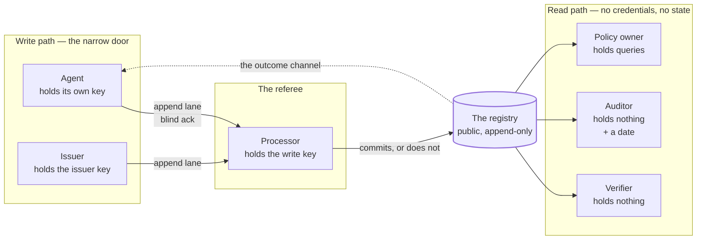
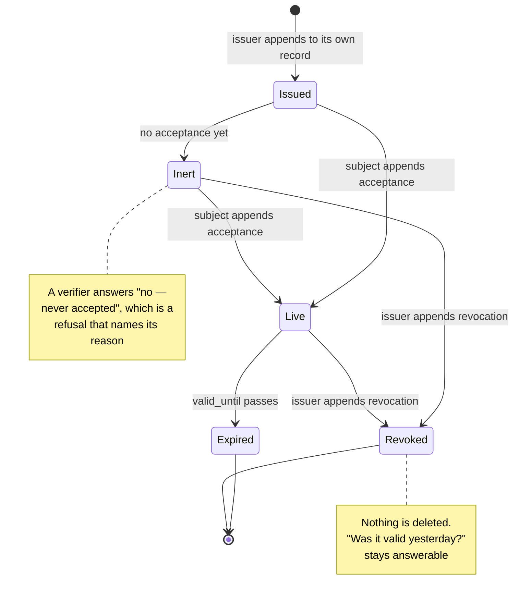

# What This Pack Actually Delivers: Six Users, Twenty-Four Stories, Fourteen Features And Six Workflows — Every One With A Test That Can Fail

**version** draft-1 (site-agent first pass — corpus version to be assigned on adoption)
**date** 20 August 2026
**from** The site agent
**to** Project lead, Engineering, Architecture, Design

**type** Dev brief — delivery scope

*Eleventh document of the registry MVP pack, and the one that turns nine documents of design into a list somebody can build against and sign off. The design documents answer "what is this and why"; the diagrams answer "what shape"; the mockups answer "what does it look like"; the maps answer "where does the novelty sit". None of them answers **who gets what, and how do we know it works**. This does. Limitation: the stories are derived from the design and from three project-lead briefs, not from users — there are none yet, which is what the tabletop in document 07 exists to substitute for. Estimates are deliberately absent: a story list with invented numbers on it is worse than one without.*

---

## What This Is

The pack restated as deliverables. Three ground rules, and the second one is the load-bearing one:

1. **Every user in this document can be an LLM session**, and in at least one seat of every workflow, one always is. That is not a stylistic choice — it is the pack's thesis (document 00: the documented workflow is the first client), and it makes the acceptance criteria harsher, because a session cannot ask a human what a page meant.
2. **Every story has a test that can fail.** A story whose acceptance criterion cannot come out negative is a description wearing a story's clothes. Where a test would be a tautology, the story says so rather than inventing one.
3. **Every feature names the document that defines it and the phase that ships it.** A feature with no phase is a wish, and this pack has enough of those already — they are listed under *not delivered* rather than smuggled into the table.

Nothing here is new design. Where this document appears to decide something, it is reading a decision out of documents 00–09; where the decision is genuinely open, the story is marked **blocked** and the question is in document 06's register.

## The Six Users

Each is a seat in the design, not a market segment. Each holds exactly what the design says it holds — the "holds" column is the security model in miniature.

| User | Is | Holds | The one sentence they need answered |
|---|---|---|---|
| **Verifier** | Any third party, invited or not | **Nothing.** Public URLs only | *May this agent do this, on whose authority, and until when?* |
| **Agent** | The subject enrolling and operating | Its own private key | *Am I recognised, and what am I authorised to do?* |
| **Issuer** | The operator declaring roots and issuing mandates | The issuer signing key | *What have I authorised, to whom — and what does their credential actually permit?* |
| **Processor** | The referee on the write path | The registry write key, the enum key | *Does this submission satisfy the four rules?* |
| **Policy owner** | Whoever states rules over the register | Nothing but saved queries | *Is this rule being kept — and is my check worth anything?* |
| **Auditor** | A verifier with a date | Nothing | *What was true on the 14th?* |

**The auditor is a separate seat rather than a mode of the verifier**, and the distinction is worth the row. A verifier asks about now and may take a shortcut — read the end of the record and stop. An auditor asks about a past instant, which is the only user who exercises `effective_from` properly, and the only one who would notice if history were quietly re-written. A design that serves the verifier and not the auditor has an append-only store nobody reads backwards.

The one edge worth staring at is the dotted one. **The agent learns the outcome of its own write by reading the public registry**, not from the write path — which is why the read path has to be finished before the write path is worth building, and why document 04 sequences the phases the way it does.

## The Stories

Format: the story, the test that can fail, and the tag — *phase* from document 04, *where specified*, and *screen* from document 08 where one exists.

### The verifier

**V1 — Answer cold.** As a verifier holding nothing, I can answer *may this agent do this?* from published URLs, with no account, no key, no registration and no rate limit.
*Test:* a fresh session given one URL produces the correct answer for a valid mandate, and states expiry and authority. *Fails when:* any step needs a credential, or the session cannot find the next URL from the page it is on.
`phase 3 · doc 03 · screen M7`

**V2 — Be refused with a location.** When the chain does not resolve, I am told **where it stopped**, not merely that it failed.
*Test:* against a mandate with no acceptance and an unanchored issuer, the output names both, separately. *Fails when:* the output is a boolean, or names only the first problem it hit.
`phase 3 · doc 02 (C2, partial resolution) · screen M7`

**V3 — See a revocation bite at its stated time.** A revocation with `effective_from` changes my answer for now and leaves the historical answer intact.
*Test:* the same query, asked about now and about yesterday, returns different answers, and both are right. *Fails when:* revocation is treated as deletion, or the historical question becomes unanswerable.
`phase 3 · doc 02 · inject I1 in doc 07`

**V4 — Tell unreachable from denied.** An authority that does not answer is rendered differently from an authority that says no.
*Test:* with the provider lookup blackholed, the badge reads `unreachable`, carries the last-confirmed date, and the surrounding verdict does not flip to a denial. *Fails when:* a timeout renders as a cross.
`phase 3 · doc 08 · screen M8`

**V5 — Re-run anything I am shown.** Every check the interface claims to have made, I can run myself, from the same public bytes.
*Test:* the transcript's commands, pasted into a shell, reproduce the same verdict. *Fails when:* any step of the transcript is not reproducible outside the page.
`phase 1 · doc 08 · screens M2, M9`

### The agent

**A1 — Enrol without borrowing authority.** I can establish an identity without first holding a credential larger than the one being established.
*Test:* the whole enrolment completes with a keypair, a signed statement, and an out-of-band token — nothing else. *Fails when:* any step requires an account, an access token, or a human logging in on the agent's behalf.
`phase 2 · doc 03 · bootstrap trap, site page`

**A2 — Learn the outcome by reading.** After submitting, I discover whether I was recognised from the public read path.
*Test:* the agent's own polling loop, with no privileged access, detects its record appearing. *Fails when:* the agent needs to be told out of band that it worked.
`phase 2 · doc 03 · screen M6`

**A3 — Be told nothing by the acknowledgement.** The lane's response tells me it received bytes, and nothing else — and the interface says so in those words.
*Test:* accepted, queued, ignored and declined submissions all produce byte-identical responses. *Fails when:* any of the four is distinguishable, including by timing.
`phase 2 · doc 03 · screen M6`
**Note:** this is a story whose *success* is an absence, which makes it the easiest thing in this pack to break by accident and the hardest to notice. It belongs in the automated tests, not in review.

**A4 — Accept, and become operable.** A mandate issued about me does not take effect until I have appended an acceptance to my own record.
*Test:* a verifier's answer changes from *no — never accepted* to *yes* on the strength of the agent's own append, and nothing else. *Fails when:* an unaccepted mandate verifies.
`phase 3 · doc 02 · blocked on open decision 8 (unaccepted = inert)`

**A5 — Revoke myself.** On compromise I can withdraw my own key by appending, without the operator's help and without deleting anything.
*Test:* self-revocation verifies against the revoked key itself, and prior statements stay checkable. *Fails when:* revocation needs the issuer, or removes history.
`phase 3 · doc 02 · rule 2`

### The issuer

**I1 — Declare a root, visibly.** What I anchor is a published statement anybody can read and disagree with.
*Test:* `roots.json` is fetchable, and a verifier's answer names the root it relied on. *Fails when:* the anchor is implicit in code or in an unpublished list.
`phase 1 · doc 01 · rule 4`

**I2 — Issue into my own record.** A mandate I write goes into **my** record, never the subject's.
*Test:* the processor rejects a well-signed statement whose subject-record placement violates rule 1. *Fails when:* an issuer carve-out exists at all.
`phase 3 · doc 02 (option A) · inject I2 in doc 07 · screen M4`

**I3 — See the gap before I sign.** At issue time I am shown what the subject's credential actually permits, beside what I am authorising.
*Test:* the composer displays excess authority as a count and an age, and a mandate narrower than the credential cannot be signed without the gap being displayed. *Fails when:* the number is computed only after the fact, or not at all.
`phase 3 · doc 06 C1 · screen M4`
**This is the story that most changes what the registry is for.** Without it the registry records history; with it, it produces a number somebody has to accept or close.

**I4 — Revoke with a date, not a delete.** Withdrawal is an append carrying `effective_from`.
*Test:* after revocation the record is longer, not shorter, and the pre-revocation answer is still derivable. *Fails when:* anything is removed.
`phase 3 · doc 02 · rule 2`

**I5 — Never publish a live capability.** Nothing I write can contain a usable credential, and the tooling refuses rather than trusting me.
*Test:* the validator fails the build on a capability-shaped string anywhere in the tree; a grant carries only a hash. *Fails when:* the rule is documented but unenforced.
`phase 0 · doc 02 · already enforced by this site's key-leak tripwire`

### The processor

**P1 — Apply the four rules as checks.** Each published rule corresponds to a check I run before committing, and the check is named in the runbook.
*Test:* four rules, four named checks, each with a submission that it rejects. *Fails when:* a rule has no corresponding check — which would make it an assertion again.
`phase 2 · doc 01 · doc 07 baseline`

**P2 — Log every decision publicly.** My decisions are auditable, because I am the trust boundary and an LLM session besides.
*Test:* a third party can count decisions and see their inputs. *Fails when:* rejections leave no trace at all — and note this pulls against A3, which is the tension named below.
`phase 2 · doc 04 · open`

**P3 — Refuse a write into another's record.** A well-formed, well-signed statement whose signer is not the record's owner does not get committed.
*Test:* inject I2 from the tabletop, run as an automated case. *Fails when:* signature validity is mistaken for write authority — the keyserver failure, replayed.
`phase 2 · doc 01 · rule 1`

### The policy owner

**Y1 — State a policy as an empty-set query.** A rule is a saved query over the register that must return no rows.
*Test:* the policy runs, returns rows or does not, and each row links to the evidence that produced it. *Fails when:* a policy needs an imperative rule engine to express.
`phase 3+ · doc 08 · screen M5`

**Y2 — Be told when my policy detects nothing.** If the edge a policy constrains is verifiable by nobody, the result page says so, on the success path, in those words.
*Test:* a policy over an unverifiable edge returns 0 rows **and** prints the instrumentation warning; the same policy over a signature-checkable edge does not. *Fails when:* the warning appears only on failure, or only in documentation.
`phase 3+ · doc 08 · screens M5, M9`

**Y3 — Get violations that carry their own badge.** A violation row shows how the violation itself was established.
*Test:* every returned row renders a badge; a row whose evidence is unverifiable is visibly weaker than one whose evidence is a signature. *Fails when:* rows are undifferentiated.
`phase 3+ · doc 08 · screen M5`

### The auditor

**D1 — Ask about the past.** I can establish what the registry said on a given date.
*Test:* the same query at two dates returns two correct answers. *Fails when:* only current state is derivable.
`phase 1 · doc 02 · doc 06 C7 (history is the log)`

**D2 — Detect a dropped statement.** A mirror that omits a middle statement fails a check I can run.
*Test:* remove one file from a copy; the chain check fails and names the break. *Fails when:* the omission is silent.
`phase 1 · doc 01 · diagram D3`

**D3 — Notice the index disagreeing with the records.** When the unsigned convenience and the signed truth diverge, I see it.
*Test:* desynchronise the index; the interface reports the disagreement rather than resolving it silently. *Fails when:* the index is trusted anywhere in the read path.
`phase 1 · doc 01 · screen M8`
**This is the story guarding the design's weakest joint.** The index carries no authority and is the most convenient thing in the tree, and convenient unsigned things become load-bearing by default unless something actively renders the disagreement.

## The Features

What has to exist for those stories to pass. Status is against the site as it stands today, not against intent.

| # | Feature | What it is | Defined in | Phase | Status |
|---|---|---|---|---|---|
| F1 | **Registry tree** | The public vault layout: `llms.txt`, `roots.json`, `params.json`, `index.json`, `records/` | 01 | 0 | designed |
| F2 | **Statement envelope** | `seq` + `prev` + `sig` over canonical bytes; one shape for self- and issuer-signed | 01 | 0 | designed |
| F3 | **Four object schemas** | identity, mandate, grant, revocation — plus acceptance | 02 | 0 | designed; grant superseded by C1 |
| F4 | **Canonicalisation recipe** | `jq -cS`, `sig` removed, versioned in `params.json` | 01 | 0 | designed |
| F5 | **Public validator** | Re-runnable checks over the whole tree; the four rules as code | 01 | 0–1 | **partly shipped** — this site's `validate.js` is the pattern, incl. the key-leak tripwire |
| F6 | **Read path at real URLs** | Everything fetchable, mirrorable, cacheable, no credentials | 01, 03 | 1 | designed |
| F7 | **Chain + signature verification walk** | The seven-step walk, executable from a page | 02, 03 | 1 | designed |
| F8 | **Enrolment through the append lane** | Account-less write, token in body, blind ack | 03 | 2 | **transport ships**; the registry side does not |
| F9 | **Processor runbook** | The referee as a documented procedure an LLM session can run | 01, 04 | 2 | designed |
| F10 | **Mandate issue / accept / revoke** | The three-append loop across two records | 02, 03 | 3 | designed |
| F11 | **Excess-authority computation** | grant − mandate, with an age and an acceptor (or none) | 06 C1 | 3 | designed; needs a provider lookup it cannot verify |
| F12 | **The verification badge** | Six fields, five result states, `nobody` as a value | 08 | 3 | **specified, unbuilt** |
| F13 | **Policy as a saved query** | Empty-set semantics, with the instrumentation warning | 08 | 3+ | **specified, unbuilt** |
| F14 | **Three-session demo** | The whole loop, three sessions, public URLs only, written up dated | 04 | 4 | designed |

Two honest readings of that table. **Everything at phase 0–1 is designed and nothing is built** — the pack is a design pack and says so. And **the only rows marked shipped are ones this site or the parent CLI already carries**, which is the pack inheriting rather than claiming.

## The Six Key Workflows

### WF-1 — Verify *(read, no state)*

**Actor:** verifier or auditor · **Holds:** nothing · **Trigger:** a question about an agent
`llms.txt` → `roots.json`, `params.json` → subject record → chain check → signature check per statement → follow acceptances to issuer records → revocation check both sides → **answer, or a refusal naming where it stopped**.
**Outputs:** a verdict, its basis per edge, and an explicit list of what was *not* established.
**Fails to:** partial resolution — a legitimate output, not an error.
`specified in 03 · drawn in D5 · rendered in M7 · mapped in W1`

### WF-2 — Enrol *(write, through the narrow door)*

**Actor:** agent · **Holds:** its own new keypair + an out-of-band token · **Trigger:** an agent needs recognition
keygen → canonical identity statement → sign with the key being enrolled → POST through the append lane → `{"ok":true}` → **poll the public read path** until the record appears, or forever.
**Outputs:** a record in the registry, or nothing distinguishable from nothing.
**Fails to:** silence. The blind ack is a feature (A3) and the failure mode is indistinguishable from the pending state, by design.
`specified in 03 · drawn in D4 · rendered in M6 · mapped in W3`

### WF-3 — Issue a mandate

**Actor:** issuer · **Holds:** the issuer key · **Trigger:** an agent needs standing authority
choose subject, capability, resource, constraints, **interval** → view what the subject's credential actually permits → decide on the excess → sign → append **to the issuer's own record** → processor commits.
**Outputs:** a mandate statement; an excess-authority figure that is now recorded rather than latent.
**Fails to:** a refusal — no interval, or a subject record placement that breaks rule 1.
`specified in 02 · corrected by C1, C5 · rendered in M4 · mapped in W1`

### WF-4 — Accept

**Actor:** agent · **Holds:** its own key · **Trigger:** a mandate naming it exists
read the issuer's record → verify it → append an acceptance to **its own** record referencing `{record, seq}`.
**Outputs:** a mandate that now verifies end to end.
**Fails to:** inaction, which leaves the mandate inert — proposed, and open decision 8.
`specified in 02 · rendered in M1 · story A4`

### WF-5 — Revoke

**Actor:** whoever could sign the original · **Trigger:** compromise, change, or policy
append a revocation carrying `{record, seq}`, a reason, and `effective_from` → nothing is deleted → verifiers' answers change from that instant, and only from that instant.
**Outputs:** a longer record and a changed present, with the past intact.
**Fails to:** nothing — a revocation is not revoked, it is superseded.
`specified in 02 · rule 2 · inject I1 · stories V3, A5, I4`

### WF-6 — Run a policy

**Actor:** policy owner · **Holds:** a saved query · **Trigger:** a rule someone wants kept
run the query over the register → zero rows, or rows → **each row carries the badge of the edge that produced it** → and the result page states whether the constrained edge is verifiable at all.
**Outputs:** a verdict, and an honest statement of what the verdict is worth.
**Fails to:** a green light that means nothing — which is the failure this workflow exists to make visible rather than to prevent.
`specified in 08 · mapped in W5 · stories Y1–Y3`

### The mandate lifecycle, as states

**Two states in that diagram are the pack's whole argument about mandates.** `Inert` exists because a mandate is a two-party fact and the issuer only holds one of the parties. `Revoked` is terminal for the present and not for the past, which is what an append-only store buys and a deletion never could.

## What This Pack Does Not Deliver

Listed as flatly as the features, because a delivery document that only lists deliverables is a sales document.

| Not delivered | Why not | Where it would live |
|---|---|---|
| **Enforcement at execution time** | The registry records authority; it does not observe behaviour | The execution broker — a separate build, not scoped here |
| **Receipts** | A receipt is the executor's statement, not the registry's | Deliberately out (00); the schema reserves the reference slot only |
| **Confidentiality** | A registry contains no secrets, on principle | Nowhere — it is a non-goal, not a gap |
| **Enrolment by strangers** | The door is policy-closed: "this project's own agents" | Build-order step 6, and it deserves its own brief |
| **Proof of where an agent ran** | No vendor signs such a statement; nothing the customer can do substitutes | Map W2; the tripwire is on the research site |
| **A graph browser** | A graph view without per-edge badges is a diagram of assertions | After F12 is real — 08's own position |
| **A trust score** | Any single number averages confirmed, unreachable and unverifiable | Nowhere, deliberately (08) |
| **Estimates** | There is no team assigned and no code written | When there is |

## Traceability

One row per workflow, so a reviewer can follow any thread end to end.

| Workflow | Stories | Features | Acceptance test (04) | Screen (08) | Map (09) |
|---|---|---|---|---|---|
| WF-1 Verify | V1–V5, D1–D3 | F1, F2, F4, F6, F7 | Phases 1 & 3 | M2, M7, M8 | W1 |
| WF-2 Enrol | A1–A3 | F8, F9 | Phase 2 | M6 | W3 |
| WF-3 Issue | I1–I3, I5 | F3, F10, F11 | Phase 3 | M4 | W1 |
| WF-4 Accept | A4 | F3, F10 | Phase 3 | M1 | W1 |
| WF-5 Revoke | V3, A5, I4 | F3, F10 | Phase 3 | M1, M7 | W1 |
| WF-6 Policy | Y1–Y3 | F12, F13 | *none yet* | M5 | W5 |
| *(cross-cutting)* | P1–P3 | F5, F9 | Phase 2 | — | W6 |

**WF-6 has no acceptance test, and that is a finding rather than an omission to tidy.** Document 04's four phases were written before the policy layer existed as a concept; the policy workflow is specified in 08 and mapped in W5 and has no definition of done. Either phase 3 grows a fifth acceptance test, or the policy layer is honestly out of the MVP. That decision is the project lead's and is added to the open questions below.

## Honest Tensions

| Tension | Note |
|---|---|
| **P2 pulls against A3** | "Log every processor decision publicly" and "the acknowledgement tells the agent nothing" are in direct conflict for *declined* submissions: a public decision log is an oracle for exactly what the blind ack withholds. The resolution is probably delay or aggregation, and it is unresolved here rather than papered over |
| Stories derived from design, not users | There are no users. Every criterion below is an argument about what a user would need, and the tabletop is the cheapest way to find out where they are wrong before code is written |
| F11 depends on data the registry cannot verify | The excess-authority figure comes from a provider lookup that is `unreachable` more often than anything else on the page; the number most worth having is the one least often available |
| Six users is a design claim | Splitting auditor from verifier adds a seat and therefore surface. It earns its place only if `effective_from` is genuinely exercised — if nobody ever asks about the past, the split was decoration |
| No estimates, deliberately | The absence will read as incompleteness to anyone expecting a delivery plan. Numbers here would be fabricated, and a fabricated number in a delivery document outlives every caveat attached to it |
| A story list makes the design look more settled than it is | Four of these stories are blocked on decisions in document 06's register; they are marked, and marking is weaker than not shipping them |

## Open Questions

| Question | Notes |
|---|---|
| **Does the policy layer belong in this MVP at all?** | It is specified (08) and mapped (W5) and has no acceptance test. Either phase 3 grows one, or WF-6 moves out of scope explicitly |
| How is P2 reconciled with A3? | Delayed publication, aggregate counts, or committing to one of the two. Currently the blind ack wins by default, which is a decision nobody made |
| Is "unaccepted = inert" adopted? | Open decision 8. A4, WF-4 and the `Inert` state above all assume yes |
| Who signs off these stories? | The pack is site-agent authored; a story list nobody has accepted has exactly the standing of an agent saying so — the same standing this pack keeps flagging elsewhere |
| Does the auditor seat survive review? | If it does, D1–D3 need their own acceptance test in phase 1; if it does not, `effective_from` loses its only advocate |
| What is the first capability, concretely? | `repo.pull-request.create` is the pack's candidate (04); every story tagged phase 3 is written as if that decision is made |

---

*Added after publication, 20 August 2026 (site v0.1.14). No claim above has been changed — this pack supersedes rather than rewrites. Later documents that bear on this one:*

- `11__observability.md` — four more stories (I6, I7, C1, C2), five more features (F15–F19) and **WF-7**. The *not delivered* row reading “records authority; it does not observe behaviour” stays true; the layer measures around the edge of it rather than filling it
- `12__grant-tree-and-control-labels.md` — four more stories (I8, I9, A6, P4), three more features (F20–F22), and the metric family this document never stated: **counting acceptances is the one measure that inverts under pressure**, so declines and unstatable risks are instrumented first
- `13__keys-and-signatures.md` — two more stories (V7, I10) on the two cases where a check succeeds and means nothing
- `14__user-assessment.md` — a shipped surface for the verifier and issuer seats, and one measure family this pack can state and cannot instrument, because the page deliberately has no backend
- **C23** — the feature table's honest reading, *everything at phase 0–1 is designed and nothing is built*, is still true of F1–F19 and no longer true of the pack. What shipped is a **consumer** of this model, not a piece of the registry. And this document's named-acceptor test was found **unmeetable** on a page that stores nothing about its visitor

---

This document is released under the Creative Commons Attribution 4.0 International licence (CC BY 4.0).
