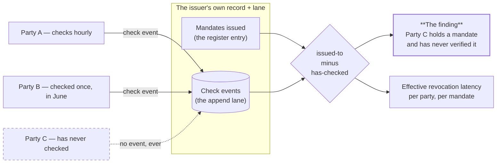

# Nobody Can Tell You Who Is Using A Mandate — But The Issuer's Own Lane Can Tell You Who Has Never Checked One: Observability As The Half That Makes The Mandate Layer Defensible

**version** draft-1 (site-agent first pass — corpus version to be assigned on adoption)
**date** 20 August 2026
**from** The site agent
**to** Project lead, Engineering, Architecture, Security

**type** Architecture brief — observability

*Twelfth document of the registry MVP pack, and the one that answers a question this site has been raising, and declining to answer, since the mandate page was published: **a mandate says what an agent may be authorised to do, not what it does — so how does anybody know who is using it?** The answer from the v0.33.61 observability brief is not the one the question expects. You cannot know. What is capturable is **verification, not use**, and the two come apart in both directions. What makes that worth building anyway is the inversion: the valuable output is not the edges that exist but **the ones that do not** — the parties holding a mandate who have never once checked it. Limitation: no volumes exist yet, so the capacity arithmetic here is from the append lane's published limits rather than from measurement, and one property the whole layer depends on is absent from the lane's reference and is carried below as an open question rather than assumed.*

---

## What This Is

The observability layer, and the single decision inside it that determines whether it is a security property or a surveillance product.

Three things arrive together, and the pack needs all three:

1. **Observability is not an adjunct to the mandate layer. It is what makes the pack's own description of that layer honest** — and it makes a claim already published on this site either true or empty.
2. **A check event is written by the checker into the issuer's own lane**, never into a central log at the registry. That is not a preference; it is this corpus's own rule about who appends what, applied to telemetry.
3. **The primary query is a list of absences**, which is the same shape as the register interface's most useful page, and in both cases the absence is the actionable half.

## Why This Is Load-Bearing Rather Than Nice To Have

The pack has already published a position that depends on this document existing.

The grant/mandate brief drew a hard line: the **execution broker is enforcement**, because the agent never holds the credential; the **declared mandate is instrumentation**, because nothing prevents the holder doing more. It recommended building declared mandates anyway, and the entire justification was that they are cheap and **they produce the data that says where enforcement is worth its cost.**

> **Without check events, they produce no data.**

A declared mandate with no observability is a document nobody reads, generating nothing, and the recommendation to build one would be indefensible. This is the corpus's *instrument before you enforce* rule arriving as a dependency rather than as advice: observability is the half that makes the honest description of the mandate layer honest.

**So the sequencing commitment is not a preference either.** Observability goes in at the beginning, in the same phase as mandates, not added afterwards — because a mandate layer shipped without it cannot be justified in the terms the pack used to justify it.

## The Question This Site Kept Raising

The gap is stated, in nearly the same words, in four places across this estate:

| Where | What it says |
|---|---|
| [The mandate page](../../mandate/index.html) | *A signed mandate constrains what an agent may be **authorised** to do, not what it does within that authority.* And: it "does not observe the agent, bound its spend, cap its time, or tell you where it reached" |
| `02__schemas.md` | The registry **records** mandates; enforcement is the broker's job — the caution travels with the schema |
| `08__ux-mockups.md`, screen M7 | Under *not answered*: "Whether anything it does stays inside this mandate. This register records authority; it does not observe behaviour" |
| `10__user-stories-and-features.md` | *Enforcement at execution time* is listed flatly as **not delivered** |

Four statements of the same hole, none of them wrong, and none of them offering anything in its place. This document is what goes in its place — and the first thing it does is refuse the question as asked.

## A Verification Is Not A Use, And The Error Runs Both Ways

The intuition is that you learn where a mandate is being used by capturing who checks it. **The intuition is close and the conclusion it invites is wrong**, because what is captured is verification, and verification and use come apart in both directions:

| Situation | Event generated | Consequence |
|---|---|---|
| A mandate is used, and the relying party verifies it | Yes | The intended case |
| A mandate is used, and the relying party does not bother verifying | **None** | **The dangerous case is silent** |
| No use, but a resolver walks the chain past it | Yes | An event with no usage behind it |
| No use, but a monitor or a curious party probes | Yes | Noise that reads as adoption |

So what this layer draws is a **verification graph**, and reading it as a usage graph will produce confident wrong answers. **The error is in the worst possible direction**: the party that never verifies is exactly the party whose relying process is weakest, and it is the party this layer cannot see.

Tail-off — heavy checking at the start, then less — is the *detectable* version of that problem. A party that never checked at all was never visible to begin with.

**This is why the pack's four existing statements of the hole should stay exactly as they are.** Observability does not close them. It measures around the edge of them, and a document that let those four sentences be softened would be doing the overclaiming the site exists to argue against.

## So The Missing Edges Are The Product

Turn the design around, and it lands where this corpus keeps landing: **the gap is the finding.**

The valuable query is not *who checked*. It is:

> **Which parties hold a mandate issued by me and have never once verified it?**

**And that join is computable**, because the issuer holds both halves: it knows who it issued to, and its own lane records who checked. `issued-to` minus `has-checked` is small, cheap, and every row in it is a relying party accepting a mandate on faith.

That is a better product than an adoption dashboard, and it is the same shape as screen M3's *how much of this register is checkable* panel and screen M1's *what nobody can check* block. Three lists of absence, and in each case the absence is the actionable half.



The dashed edge is the one that matters, and it is drawn dashed because **it does not exist**. Party C is derived from the register entry, not observed from the lane. That is the whole mechanism: the layer sees who checked, and the issuer computes who did not.

## Where The Events Are Written Decides What This Is

The most consequential decision here, and it resolves a tension the pack was already carrying rather than leaving two positions standing.

**Change control C9 recorded a warning against exactly this dataset.** A live notary accumulates a map of who is currently evaluating whether to trust whom; neither party handed it over; the subject is never told it was checked; and for a project positioned on the server being unable to read your content, holding that graph in plaintext is the sharpest available contradiction.

This document proposes building that dataset as a security feature. **Both are right, and the difference is entirely in who accumulates it.**

| Design | Who accumulates | What it is | Consent |
|---|---|---|---|
| A central check log at the registry | The operator | **A live map of who is evaluating whom, across everybody** | Nobody gave it |
| Check events into the **issuer's own lane** | Each issuer, for its own mandates | **An owner observing their own asset** | Implicit in holding the mandate |

**The pack's own rule settles it** — the rule taken from the 2019 keyserver failure and restated as rule 1: *evidence is appended by the asserter to its own record, never to the subject's and never to a third party's.*

> **The checker writes the check event into the issuer's lane.** The issuer learns who checked the mandates it issued. **No party learns who checked everybody's, because no such record exists anywhere.**

Three properties follow, and the third is a cost rather than a benefit:

**There is no central observability store**, so there is nothing central to compromise — the catastrophic-failure principle applied to telemetry rather than to keys.

**The checker's exposure is bounded and comprehensible.** Checking a mandate tells its issuer that you checked it, which is a statement about a relationship you already have, rather than a data point in a stranger's dataset.

**And the aggregate is foreclosed.** The operator cannot see, sell or reason over the whole graph — which removes precisely the asset C9 identified as more valuable than the answers being sold. Same trade as publish-rather-than-answer, one layer down: **the design that protects the positioning is the design that destroys the dataset**, and it should be chosen deliberately rather than discovered later.

## Derived, Never Declared

**Usage is never written into the register entry.** It is derived from the lane on demand.

That agrees with two positions already settled: the June principle of **clues rather than storage**, and C7's rule that an entry carries current state and no accumulated history, because growth belongs somewhere designed for growth.

So the entry says what the mandate *is*. The lane says who *asked about it*. Nothing has to be declared, kept in step, or trusted — and **the register does not grow every time somebody looks at it.**

## The Shipped Lane Is The Mechanism, And It Has Numbers

The transport exists and needs no design. Append is account-less, takes a token in the body, and returns a blind acknowledgement — exactly an `ok`, with no file identifier, no count, no metadata. **That is precisely right here**, because a checker reporting a check must not learn anything about the lane it wrote to, including how busy it is.

The published limits set the shape:

| Limit | Value | On breach |
|---|---|---|
| Payload per write | 5 MB | 413 |
| **Pending files per token** | **1000** | **507** |
| File identifiers per batch | 100 | 400 |
| Inline content when listing | 3 MB cumulative | 413 |
| Page size | 50 default, 200 maximum | Clamped silently |

**The binding constraint is a thousand pending files per token**, and a check event is small and frequent — the worst combination for that particular limit. Three consequences:

**Draining is an obligation, not an option.** An issuer that does not enumerate and mark or purge will fill the lane, and further writes are refused. So observability creates ongoing operational work for the issuer — and **an issuer who stops draining stops receiving evidence without being told**, which is a silent failure of exactly the kind this pack keeps recording. *The drain needs monitoring more than the lane does.*

**Or checkers aggregate**, batching several checks into one event, trading freshness for volume — the same commit-queue trade the corpus already reasoned through, to be reused rather than reinvented.

**And the read side is paginated**, at 200 per page and clamped silently, so a busy issuer's drain is itself a paginated job rather than a single call.

**One property the design depends on is not stated in the lane's reference.** The configure endpoint registers append anchors as hashes of accepted senders, and the documentation does not say whether a lane with **no** anchors configured accepts any holder of a token or refuses everything. That decides the coverage of this entire layer:

> If anchors are required, only checkers the issuer already registered can report — and **the relying parties you most want to observe are the ones you do not know about.**

This has to be answered before the layer is committed. It is on comms as a documentation gap against the parent's API reference, not as a pack decision.

## Effective Revocation Latency, Measurable Before Anything Is Revoked

The sharpest thing in this design, and it is worth promoting from an aside to a defined metric.

**In this design there is no push.** A revocation does not travel. It sits in the register until a relying party looks — so a revocation propagates at exactly the rate at which parties check. That is usually stated as a weakness. It is also a measurement:

> **A relying party's effective revocation latency is the interval between its checks.** It is computable per party and per mandate, from the check events, **before anything has ever been revoked.**

Conventional key infrastructure cannot do this, because the consumers of a revocation list are invisible to the issuer. Here they are visible — because they wrote to the issuer's lane. So an issuer can publish, in advance, a distribution: *half the parties relying on this mandate would notice a revocation within an hour, ninety-five percent within a day, and these four would never notice at all.*

**And it yields one of the very few mandate clauses that is genuinely decidable.** A mandate clause is decidable when it constrains something the system already sees; almost none of the interesting ones qualify. This one does:

> **Verify this mandate at least once every twenty-four hours.**

A relying party that fails it is in breach of a term of the mandate it holds, and the breach is visible in the issuer's own lane **without any cooperation from the party**. Worth having precisely because it is so rare.

The honest limit belongs beside it, in the same breath: **for a party that never checks, the latency is infinite and invisible.** The published distribution describes the parties that participate, not the population.

## What A Check Event Carries, And What It Must Not

Short, and the second table is the one that keeps this on the right side of the line drawn above.

```json
"type": "check",
"body": {
  "checked": { "record": "sha256:<issuer fp>", "seq": 7 },
  "question": "authorisation | chain-walk | existence",
  "result": "confirmed | denied | unknown | unreachable",
  "anchor": "sha256:<the root it was resolving toward>",
  "checker": "sha256:<checker fingerprint, or a stable pseudonym>",
  "at": "2026-08-20T09:41:07Z"
}
```

| Must carry | Why |
|---|---|
| The mandate or entry identifier | What was checked |
| Timestamp | The latency metric depends on it |
| Checker identity, **or a stable pseudonym** | Otherwise the missing-edges join cannot be computed |
| The question asked | A chain walk and an authorisation check are different events |
| The result | The same four states as the badge — deliberately |
| The anchor it was resolving toward | So a chain can be reconstructed |

| Must **not** carry | Why |
|---|---|
| **What the checker was authorising** | The issuer has no claim on the checker's business, and including it turns an asset log into a customer surveillance log |
| The checker's own credentials or tokens | Nothing about a check requires them |
| Anything the issuer could not already infer from holding the mandate | **The consent argument above depends entirely on this boundary** |

**That second table is the design.** Remove it and this becomes the thing C9 warned about, with the issuer in the operator's chair.

## This Populates The Badge

A build note rather than an argument, and the third time two documents in this pack turn out to need one thing.

Document 08 specifies a badge on every edge carrying, among other fields, **when the edge was last checked and what the result was**. That field has no data source in document 08. **It has one here: the issuer's lane is where *last checked* comes from.**

So this is not a separate system with its own dashboard. **It is the interface's evidence, and the badge is its user interface.** Building it twice — once for a telemetry view, once for the register — would produce two answers to the same question, and the register would eventually be the one that is wrong.

Two consequences for document 08's screens, which need no redesign, only a source:

- **M1's badge dates** (`checked 20 Aug 09:14`) are lane-derived for issuer-owned edges.
- **A new row belongs on M4**, the mandate composer: beside *interval* and *revocation path*, the issuer should see the subject's **check interval and last-checked date** before issuing again. A party that has never verified the mandate it already holds is a strange party to issue a second one to.

## What This Does Not Try To Be

| Not | Why |
|---|---|
| **A usage graph** | It records verification, and the parties that never verify are invisible to it |
| **A central log** | Events go to the issuer's lane; no aggregate exists anywhere |
| **A record of the checker's business** | The event says a check happened, never what was being authorised |
| **Push-based revocation** | Nothing travels — the latency metric exists *because* propagation depends entirely on checking |
| **Free to run** | Draining the lane is continuing work for the issuer, and it fails silently if it stops |

## The Timing Channel, Both Halves

Stated because the pack's rule is that a breach claim without its exception is unfalsifiable.

**Content in the lane is encrypted client-side and the server holds hashes of the capabilities**, so a compromised server does not learn who checked what.

**And the lane's growth rate is observable.** Check events are small, frequent writes, so anybody able to watch object count and timing learns how heavily a mandate is being exercised, and when, without decrypting anything. That is the shape-of-the-estate disclosure the corpus recorded on 19 August, arriving where the shape is more sensitive than usual — **the rate of checking is itself a business signal.**

Checker-side aggregation helps here as well as with the token limit, which is a rare case of a capacity fix and a privacy fix being the same change.

## What This Adds To Document 10

The deliverables document predates this layer. Rather than rewrite it, the additions are stated here and its cross-reference block points back — the pack supersedes rather than edits.

**Four stories**, in document 10's format:

**I6 — See who has never checked.** As an issuer, I can list the parties holding a mandate I issued that have never once verified it.
*Test:* with three holders and check events from two, the list returns exactly the third. *Fails when:* the answer is derived from the lane alone, which can only ever return parties that did check.
`phase 3 · doc 11 · new screen needed`

**I7 — Publish a revocation-latency distribution before revoking anything.** As an issuer, I can state how fast a revocation would actually propagate, per party.
*Test:* the distribution is computed from check intervals with nothing revoked; the never-checked parties appear as infinite rather than being dropped from the denominator. *Fails when:* the metric is computed only over participants and presented as a population figure.
`phase 3 · doc 11 · story I6's data`

**C1 — Report a check without learning anything.** As a checker, I can report a check into the issuer's lane and learn nothing from doing so — not whether it landed, not how busy the lane is.
*Test:* the response is byte-identical regardless of lane state, including when the lane is full. *Fails when:* a full lane is distinguishable from an empty one by response, status or timing.
`phase 3 · doc 11 · blocked on the anchors question`

**C2 — Not have my business recorded.** As a checker, the event I write says a check happened and never what I was authorising.
*Test:* the event schema has no field for it, and the validator rejects unknown fields rather than storing them. *Fails when:* the schema is open — the consent argument depends entirely on this being closed.
`phase 3 · doc 11`

**Five features:** F15 check-event schema · F16 check reporting through the shipped lane · F17 the `issued-to` minus `has-checked` join · F18 effective revocation latency · F19 lane draining, **with drain monitoring**, because F19 without monitoring fails silently and takes the whole layer with it.

**One workflow, WF-7 — Report and observe.** Checker verifies (WF-1) → appends a check event to the issuer's lane → blind ack → issuer drains the lane on a cadence → issuer computes the join and the latency distribution → **the output is a list of parties that are not in the lane at all.**

**And one amendment to document 04.** Observability cannot be a later phase: the justification for building declared mandates *is* the evidence this produces. It belongs in **phase 3, with mandates**, and phase 3's acceptance test should grow a fifth case — *an issuer names a holder that has never checked* — which is also the acceptance test document 10 found missing for WF-6, arriving from a different direction.

## Honest Tensions

| Tension | Note |
|---|---|
| **Observability as a security property** | It is the evidence that makes declared mandates defensible **and** it is the dataset this estate warned against holding. Only the location of the log separates the two, which is a thinner margin than it sounds |
| **Issuer-held logs** | They keep the aggregate from existing, and they destroy the most commercially valuable dataset the registry could have produced. Chosen, not discovered |
| **The checker is revealed to the issuer** | It is a relationship that already exists — but some checkers will not want their evaluation known, which pushes them to the published path that generates no event at all |
| **Publishing versus observing** | C9's privacy-preserving verification route is invisible to this layer, so **the two good designs actively subtract from each other**. The better the publish path, the blinder the observability |
| **Draining as an obligation** | It bounds storage honestly, and an issuer that stops draining loses evidence without being told |
| **Effective revocation latency** | A real number that describes only the parties that participate — which are not the ones that worry you |
| **The pack's four "does not observe" statements** | They stay. This layer measures around the edge of the hole; it does not fill it, and softening them would be the overclaim the site exists to argue against |

## Open Questions

| Question | Notes |
|---|---|
| **Does a lane with no anchors accept any token holder?** | Absent from the parent's API reference, and it decides whether unknown relying parties can report at all — the coverage of the entire layer. On comms as a documentation gap |
| Is the checker identified or pseudonymous? | The missing-edges join needs **stability, not identity**, so pseudonymous is the weaker claim that may well be enough |
| Who drains, and what watches the drain? | The failure is silent and the layer is worthless once it starts |
| Do published statements carry a reporting obligation? | A checker fetching a published answer generates nothing, so the publish design and this one cannot both be complete |
| What is the aggregation window for checkers? | The same trade as the commit queue; it fixes capacity and the timing channel together |
| **Can an issuer prove it did not delete inconvenient events?** | The lane is the issuer's own record, so the issuer can purge it — which is C8's reference-mutability problem arriving in a new place, and it means the missing-edges list is a claim by the issuer about the issuer |
| Which phase does this ship in? | It cannot be phase 5. The justification for the mandate layer depends on it, so it belongs **with** mandates in phase 3, and the build order needs amending |

---

*Added after publication, 20 August 2026 (site v0.1.15). No claim above has been changed — this pack supersedes rather than rewrites. Later documents that bear on this one:*

- `13__keys-and-signatures.md` — *sign by default, and publish which signatures anybody actually checks.* This layer is what makes that measurable, and without it a fully signed graph manufactures the appearance of assurance

---

This document is released under the Creative Commons Attribution 4.0 International licence (CC BY 4.0).
