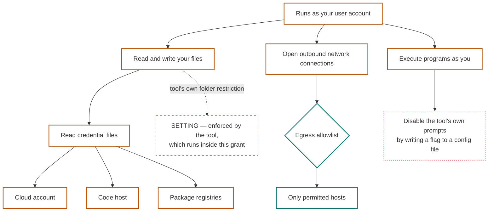

# A Grant Is A Tree And The Label On Each Node Is The Whole Point: A Control Bounds A Grant Only When Something Outside The Grant Enforces It, And Counting Acceptances Is The One Metric That Inverts

**version** draft-1 (site-agent first pass — corpus version to be assigned on adoption)
**date** 20 August 2026
**from** The site agent
**to** Project lead, Engineering, Architecture, Product, Security

**type** Architecture brief — the grant side

*Thirteenth document of the registry MVP pack. The pack has been treating a grant as a flat set of capabilities, and the excess-authority figure on screen M4 as a count. The v0.33.61 end-to-end brief corrects both: a grant is a **tree**, blast radius is a **path through it**, and the load-bearing part is not the tree but the **label on each node** — specifically who enforces the thing standing in the way. It also supplies the general test that makes those labels writable without any vendor-specific claim, adds a second finding beside excess authority, and corrects a metric the pack had not yet stated but would have adopted. Limitation: the hosted grant tree below was measured on one vendor, one surface, one date, and generalising from it would be exactly the error this document warns about. No local install was measured; that tree is taken from a published third-party audit tool rather than invented here.*

---

## What This Is

Four corrections and one addition, all on the **grant** side of the grant/mandate pair — which is the side the pack has specified least and now needs most, because C1 made the gap between them the product.

The pack's current position, from document 02 and screen M4, is that a grant records a capability instance and that excess authority is *grant minus mandate*, rendered as a count: **41 repositories against 1**. That is right in outline and too flat to act on. This document gives it structure, labels, a second finding, and a metric that does not invert under pressure.

## The Flow Was Already Specified, With A Different Twin

Worth saying first, because it changes the size of the job. The chain running from *what an agent can reach* through facts and evidence to *somebody accepting a risk* does not need designing. It was worked end to end on 2 August against a regulatory provision and a deployed system. Substituting this pack's subject:

| The worked-example model | This scenario |
|---|---|
| Reality | The agent, installed and running |
| **The twin** | **The agent installation** — what facts attach to |
| Facts | The grant tree, and the mandate; each evidenced or explicitly marked unevidenced |
| Evidence | Audit output, configuration export, a **tested** boundary |
| The provision findings derive from | **The mandate** — the statement of what was intended |
| Derived finding | **Excess authority**, computed rather than asserted |
| The risk chain | Developer → team lead → security → board |
| Decisions | Separate nodes, each with a **named acceptor and an interval** |
| Questions | The ones with no evidence behind them |

**The fourth row is the substitution that makes it work.** In the August example a finding was arithmetic because it set a fact against a written obligation — thirty days of logs against a six-month requirement. Here the same move applies: **excess authority is a fact about the grant set against a statement of the mandate**, which is why it is computed rather than a matter of opinion, and why it is defensible in front of somebody being asked to accept it.

So the work is instantiation, not design. What genuinely needs building is the tree, its labels, and the interface.

## Excess Authority Has A Twin The Pack Was Missing: The Shortfall

C1 gave the pack `grant − mandate`. The other direction exists and the pack has never named it:

| Region | What it is | Who it hurts |
|---|---|---|
| **Excess authority** = grant − mandate | The holder can do more than it was authorised to | Security. Unaccepted by construction, defaults to critical |
| **Shortfall** = mandate − grant | The holder was authorised to do something its credential cannot do | Operations. The agent fails, and the failure looks like a bug |

**The shortfall is the harder of the two to detect**, and the pack should say so rather than quietly adding a field. Excess needs the grant enumerated, which tooling can do. The shortfall needs the **mandate** enumerated against real capability names, and nobody has that yet — the pack's `capability` field is a single string chosen from a vocabulary that does not exist. So the shortfall is named here as a region and left unimplementable until the capability vocabulary is real.

## The Grant Is A Tree, And The Nodes Need Labels More Than Names

A flat list of what an agent can reach is not useful, because the interesting relationships are **containment** ones. Running as your user contains reading your files, which contains reading your credential files, which contains reaching every service those credentials open.

> **Blast radius is a path through the tree, not an item in a list.**

Enumerating the tree is the easy half and tooling will do it. **The half that decides whether any of this is worth reading is the label on each node** — and the label is the same shape document 08 gave every edge: not just what is reachable, but what stands between the agent and it, who enforces that, and whether anybody has checked.

| Field | Values |
|---|---|
| What is reachable | The subgrant |
| What stands in the way | Named mechanism, or **nothing** |
| **Who enforces it** | **Boundary · Setting · Expectation** |
| Evidence | Tested · documented · asserted |
| Date checked | Because this ages, and **per node, not per tree** |

**That third row is the column the whole thing exists for, and it is the one nobody currently publishes.**

## A Control Bounds A Grant Only If The Grant Does Not Include It

The general test, and it needs no claim about any particular product — which matters, because vendor-specific security assertions age in weeks and invite argument.

> **A control bounds a grant only when it is enforced by something the grant does not include.**

Three tiers follow, and every containment mechanism falls into one:

| Tier | Enforced by | Example shape | Worth |
|---|---|---|---|
| **Boundary** | Something **outside** the grant: the OS, a separate user account, a container, a network policy, a remote service | An egress allowlist the process cannot edit | **Real.** It holds against a compromised agent |
| **Setting** | The tool itself, running **inside** the grant | A directory restriction the application enforces; an approved-tools list; an auto-approve toggle | **Bypassable** by anything able to run code as that user — which the grant includes |
| **Expectation** | **Nothing.** It is written in a prompt or a policy file | Instructions in a project rules file | **None.** It is a mandate, and the pack already says what a mandate is worth |

**The middle tier is where most of what people currently rely on sits**, and it is the tier that *reads* like a boundary and *behaves* like a setting. This is the pack's own line about the execution broker arriving in a new place: a safe inside a house you handed the keys to is a delay, not a boundary. A folder restriction enforced by the application, running as you, inside a grant that includes running programs as you, is the same object.

**And the command-line case is worse rather than better**, for a reason worth stating precisely: a permission prompt that can be disabled by a flag in a file the agent can write is **a tier-three expectation wearing tier-two clothing.** The published audit tool named below looks for exactly this.

Read the diagram by its edges rather than its boxes. The **egress allowlist** is the only thing on it enforced from outside the grant, which is why it is the only real boundary drawn. The folder restriction is dashed because the same tree contains *execute programs as you*, and anything that can execute as you can go around it.

## The Two Scenarios Are The Two Populations, And Neither One Wins

Local and hosted are not two examples of one thing. They are the run/rent split the research site is built on, and the trees have **structurally different shapes** rather than different contents.

| | Agent on your machine | Agent hosted by a vendor |
|---|---|---|
| Size of the grant | **Enormous.** It runs as you, so it inherits everything you can reach | **Smaller.** It reaches a workspace, not your life |
| Who owns the containment | **You** — you could add a separate user, a container, a network policy | **The vendor.** You can install nothing |
| Can you inspect it | **Yes** | **No** |
| Can you strengthen it | **Yes, and almost nobody does** | **No** |
| Can you verify what it claims | **Yes, by testing** | **No** — and W2 of document 09 is why |

> **Locally, the containment is available and unused. Hosted, the containment may be excellent and is unverifiable.**

**So neither dominates**, and a product that presents them as two rows of one table will mislead. They produce different risk statements, different acceptors and different remediation.

### One hosted tree, measured

Measured inside a running agent container on 20 August, with the boundary **tested by making requests** rather than read from documentation. No vendor is named, because the point is the taxonomy rather than the grade:

| Node | Observed |
|---|---|
| Process identity | **Root inside the container.** No internal boundary at all |
| Escalation | Passwordless — the distinction between the agent's user and the box's administrator does not exist |
| User files | None, beyond what was deliberately put into the session |
| Credential stores | Present but empty of usable material |
| Signing identity | A configured commit signing key — the agent can produce signed commits under a stated identity |
| **Network egress** | **Allowlisted.** A package index resolved; an arbitrary public host returned nothing |

**The last row is the whole taxonomy in one measurement: the agent is root, and root cannot defeat it**, because it is not enforced by anything inside the container. It is a tier-one boundary demonstrated rather than claimed — and it is worth publishing precisely because the answer is *favourable*. A site that only publishes unfavourable findings is doing advocacy; one that publishes a good result it tested is doing measurement.

**The local tree does not need inventing.** A published read-only audit for exactly this purpose enumerates it in modules — credentials and their permissions, cloud and cluster credentials, registry tokens, code-host credentials, workspace environment files, signing keys; agent tool configuration including permission-skipping flags in shell initialisation and approved-tool lists; token scope; environment separation; and sessions and history. Two things to take from it rather than rebuild: **its module list is a ready-made first version of the local tree**, which makes the pack's taxonomy comparable with a public tool rather than private, and its sessions module **independently confirms** a finding this corpus reached by inspection — that a session transcript is a superset of every file the session read, so excluding a secret by path does not exclude its contents. Two routes to one conclusion moves it from an observation to a finding.

## Prohibitions Are The Presentation Layer, Allow-Lists Are The Enforcement Layer

C12 settled that a mandate written as prohibitions **widens silently** whenever a supplier ships a capability, because a deny-list cannot exclude what did not exist when it was written. That finding stands and is about **storage**. This one is about **presentation**, so both are right.

| Presented as an allow-list | Presented as prohibitions |
|---|---|
| May read files under one project directory; may invoke three named tools; may open outbound connections to two hosts | **Will not read your credentials. Will not open your browser sessions. Will not act as you anywhere else. Will not reach other machines on your network** |

The right column is what a person can actually accept or refuse. The left column is what the system must store and check.

> **Generate one from the other.** The person reads and accepts the prohibitions; the system enforces the allow-list. The prohibitions are a **rendering of the allow-list's complement over a known capability set**, and they carry a stated date — because the moment the capability set grows, the rendering is stale.

That last clause is where the two findings meet rather than collide: **a deny-list is unsafe as a stored rule and safe as a generated view**, precisely because a view can be regenerated and a stored rule cannot notice that the world moved.

And it is not cosmetic. **A person cannot accept a risk they cannot understand**, so the presentation form sits upstream of the metric below.

## Counting Acceptances Is The One Metric That Inverts

The pack has not stated a success metric, and the obvious one — *how many risks get accepted* — is the one that fails under pressure.

**A count of acceptances is maximised by making risks easy to accept:** shorter statements, smaller scopes, softer wording, one button. A product optimised on that number converges on blanket acceptance by people who did not read — **worse than no register at all, because it manufactures evidence that somebody considered it.**

The corpus already has the vocabulary: *accepted* and *acceptable* are orthogonal axes. So the metric family:

| Measure | Why |
|---|---|
| **Risks stated well enough to be accepted** | **The primary one.** A risk qualifies only if it can carry a named acceptor and an interval |
| Risks accepted, with a named person and a review date | Secondary, and only meaningful given the first |
| **Risks declined, escalated, or sent back** | **A hundred percent acceptance means the risks are trivial or the process is theatre** |
| Acceptances that survived their review | The only measure of whether anybody meant it |
| **Risks that could not be stated** | The gap — and the most informative number in the set |

**The third row is the one to instrument first**, because it is the cheapest test of whether the thing is doing anything at all. The last row is this pack's own habit arriving again: the fourth list of absences, after M1's unverifiable claims, M3's unverifiable fraction, and document 11's never-checked parties.

## A Prepared Tree Is A Dated Claim About Somebody Else's Product

Rendering a prepared tree for a named agent is the right interaction and it carries an obligation: it is **publishing an assessment of other people's products under their names.** The participant rules this site already applies to comparisons apply here without change — every entry carries a **verification date and a re-run method**, the method is published before the findings, and the participant writing it is named on the page rather than in a footer.

Two specific consequences:

**Each node's label needs its own date, not the tree's.** A vendor changing one default invalidates one row, and a tree dated as a whole is quietly wrong in one place while looking current.

**And the re-run method for the local tree already exists**, which is a gift: pointing at a published read-only audit and saying *this is how we produced these rows, run it yourself* is stronger than any assertion the site could make, and costs nothing.

## What This Changes In The Pack

Stated here rather than by editing the published documents.

**Document 02 (schemas).** The grant body's `instance.descriptor` stays. Two additions are queued for draft-2: a grant is a **tree**, so the body needs a parent reference and the tree's shape is part of the object rather than metadata about it; and each node carries the five-field label above, of which `enforced_by ∈ {boundary, setting, expectation}` and a **per-node** `checked` date are the load-bearing ones.

**Document 08 (mockups).** Two screens change, neither in layout:
- **M1's excess-authority box** currently reads *40 repositories*. A count is the summary of a path; the box should be expandable to the path through the tree that produces it, because *40 repositories* and *the credential that reaches them is readable by anything running as this user* are different findings.
- **M4's composer** should render the mandate **as prohibitions** for the person signing, while storing the allow-list — with the rendering's date shown, since it goes stale when the capability set grows.

**Document 10 (deliverables).** Four stories and three features, below.

**Document 04 (build order).** The grant tree is not phase-3 work hiding inside the mandate phase. It is its own thing with its own tooling dependency, and the pack should say whether it is in the MVP at all — see the open questions.

### Stories, in document 10's format

**I8 — See the path, not the count.** As an issuer, the excess-authority figure expands into the path through the grant tree that produces it.
*Test:* the expansion names each node and its tier; a tree with the same count but a different worst path renders differently. *Fails when:* the finding is a number with no path behind it.
`doc 12 · screen M1`

**I9 — Know which controls are real.** Every node of a grant tree I am shown carries who enforces it, and I can tell a boundary from a setting without knowing the product.
*Test:* a tool-enforced folder restriction inside a grant that includes code execution renders as `setting`, not `boundary`. *Fails when:* the label is taken from vendor documentation rather than from the test.
`doc 12 · new`

**A6 — Accept something I can understand.** As the person accepting, I am shown prohibitions and the system stores the allow-list.
*Test:* the acceptance record says **which rendering was shown, and when**. *Fails when:* the record says only that a mandate was accepted — because what was accepted was a view.
`doc 12 · screen M4 · open question below`

**P4 — Count the declines.** The register reports risks declined, escalated and *unstatable* beside risks accepted.
*Test:* a period with 100% acceptance and zero declines raises a flag rather than reading as success. *Fails when:* acceptance is the only number on the page.
`doc 12 · new`

**Features:** F20 grant tree with per-node control labels · F21 prohibition rendering generated from the stored allow-list, dated · F22 the metric family, with declines and unstatable risks instrumented first.

## Honest Tensions

| Tension | Note |
|---|---|
| The three-tier test | It is general and needs no vendor claim — and applying it honestly will label a great deal of what people currently rely on as a **setting**, which will be argued with |
| Neither population dominating | It is the honest finding and it denies the reader the simple answer they came for |
| Prohibitions as a generated view | It reconciles legibility with safety, and it means the thing the person accepted is a **rendering** — so acceptance is of a view rather than of the stored rule |
| One measured hosted tree | Real evidence, and it is one vendor, one surface, one date. Generalising from it is the error this document warns about |
| Publishing prepared trees | It is the entire user experience, and it is a dated assessment of other people's products that somebody maintains forever |
| Acceptance as an objective | The direction is right and the number is gameable, and the version that is not gameable is harder to explain to a buyer |
| The shortfall | Named honestly and unimplementable until a capability vocabulary exists, which makes it a region on a diagram rather than a feature |

## Open Questions

| Question | Notes |
|---|---|
| **Is the grant tree in this MVP at all?** | It needs enumeration tooling the pack does not have. The registry could hold trees produced elsewhere and never produce one itself — which may be the right MVP scope, and is the project lead's call |
| What does the person actually accept — the rendering or the rule? | If prohibitions are generated, the acceptance record must name the version shown. Otherwise a regenerated view retroactively changes what was agreed |
| Who maintains the prepared trees? | Every node is dated, and a vendor default change invalidates rows silently |
| How is the shortfall detected? | Excess needs the grant enumerated; the shortfall needs the **mandate** enumerated, and the capability vocabulary does not exist |
| Does a boundary claim need re-testing, and how often? | The egress test above took two requests, so the cost is low and the cadence is unowned |
| What is the acceptor for a personal install? | The developer is the only candidate **and is also the beneficiary**, which is the weakest possible acceptance |
| Are local and hosted two products? | Different grants, boundaries, acceptors and remedies, presented so far as one page |

---

*Added after publication, 20 August 2026 (site v0.1.16). No claim above has been changed — this pack supersedes rather than rewrites. Later documents that bear on this one:*

- `14__user-assessment.md` — this document's tree, labels and three tiers, built and rendered at [/assess](../../assess/index.html) against a public library. It also answers open question 1 in the negative for now: the registry holds trees produced elsewhere and produces none itself
- **C25** — the three-tier test and the node labels, drawn as a **graph** with escalation edges, at [/assess](../../assess/index.html). Drawing the escalation is what makes the `setting` tier land: a reader sees the path that goes around the control rather than reading that one exists

---

This document is released under the Creative Commons Attribution 4.0 International licence (CC BY 4.0).
