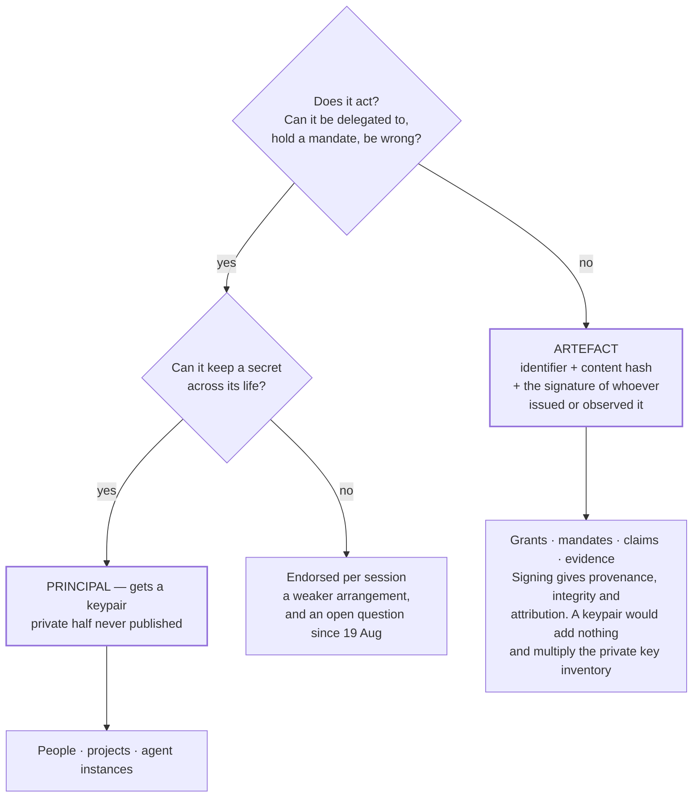

# A Key Belongs To Whatever Can Keep A Secret: A Secret Is Defined By Expectation, A Signature By Scarcity, And A Flag That Is True On Every Row Is A Column Rather Than Evidence

**version** draft-1 (site-agent first pass — corpus version to be assigned on adoption)
**date** 20 August 2026
**from** The site agent
**to** Project lead, Engineering, Architecture, Security

**type** Architecture brief — key policy

*Fourteenth document of the registry MVP pack, and the one that settles which things in this design get keypairs and which get signatures. It comes from a v0.33.61 brief that adopts a proposal's opening principle and its closing pattern and **rejects the proposal in between** — a position worth carrying across intact, because the rejected proposal (give every grant, mandate, claim and evidence node a keypair with the private half published) would quietly destroy two things the pack already depends on: the meaning of a signature, and C3's fixture flag. Limitation: the whole key-policy table below rests on one question that has been open since 19 August — whether a rented agent instance can hold a private half across sessions — and if the answer is no, one row of it is aspirational rather than achievable.*

---

## What This Is

One principle to promote, one manoeuvre to correct, one proposal to decline, and a rule that governs the rest.

The pack has been assuming key policy rather than stating it. Document 02 gives identities a bundle, mandates an issuer signature and grants a descriptor hash — which turns out to be right, and was arrived at by instinct rather than by argument. This document supplies the argument, and in doing so answers a question that has now been raised twice: **should grants and mandates have keypairs of their own?** No. And the reason is sharper than "they don't need them".

## A Secret Is Defined By Expectation, Not By Content

The principle worth writing down, because it settles a whole class of argument in one line:

> **A secret is defined by expectation, not by content.** The same bytes are a disclosure or a publication depending on whether somebody believed they were private.

The estate already behaves this way without having said it: read keys are published deliberately and write keys never; a public vault publishes its read key by definition; plaintext is allowed beside ciphertext only where the key is already published.

**Stating the principle does something more useful than tidying — it tells a reader which question to ask.** Not *is this key material?*, which sorts by class and produces the reflex that all key material is sensitive, but **did anybody expect this to be private?**, which sorts by intention and gets the right answer for read keys, fixtures and published heads alike.

**One qualification belongs with it, and it is the operational half.** The principle is about the past, and the risk is in the future:

> **Expectation has to be recorded at issue, not recalled afterwards.** A key published deliberately in March and a key leaked in March are indistinguishable in June unless somebody wrote down which was which at the time.

That is the argument for C3's `private_key_published` flag being a **required field** rather than an optional annotation — and it is the argument for a second field the pack does not yet have: not merely *is the private half published*, but **was that intended, and stated when?** A leaked fixture and a deliberate fixture render identically to every later reader.

## Destroying A Vault Makes Its Key Safe To Publish From Your Server's Point Of View, And Says Nothing About The Content

A manoeuvre the pack should understand before anybody reaches for it, because half of it is right and the half that is missing is the half that decides.

A vault key is address, credential and encryption key in one string. Destroy is a shipped operation. Destroy the vault and the credential half has nothing to authenticate against, so the key degrades from a credential into a decryption key. **All true.**

What it skips is that **a key that can no longer write can still decrypt**, and this estate has already established *custody without access*: anybody can mirror, host, back up and preserve a vault they cannot read, because holding the objects grants nothing.

| Step | Effect |
|---|---|
| Somebody clones the vault without a key | Custody. They hold complete ciphertext and learn nothing |
| You destroy the vault server-side | Nobody can write to it, including you |
| **You publish the vault key** | **Every holder of that ciphertext can now read all of it, permanently** |

So the manoeuvre converts a write credential into a **publication event**. That is fine when the content was meant to be public, and irreversible when it was not — irreversible in the way this pack has already recorded twice: a published key cannot be recalled, and clones exist that nobody can enumerate.

> **Destroying the vault makes the key safe to publish from the point of view of your server. It says nothing about the content.** Both halves have to be true before it is a good idea, and only the first is under your control.

For the registry this is directly load-bearing, because the registry's records are **public by design** — so this manoeuvre is available to it and the second condition is satisfied by construction. It is the fixtures, and anything staged in a private vault before publication, where the second condition is the one to check.

## A Signature's Value Comes Entirely From The Scarcity Of The Private Half

The proposal to decline, and the reason is one sentence. The suggestion was that every grant, mandate, claim and evidence node carry a keypair **with the private half published**, on the grounds that this supplies integrity even though it cannot supply confidentiality.

**Verification answers exactly one question: was this produced by somebody holding the key?** If the key is published, the answer is *yes* for everybody, and the question stops carrying information.

| Property | What actually supplies it | Survives publishing the private half? |
|---|---|---|
| The bytes have not changed **by accident** | A content hash. **No key required at all** | Yes — and the key was never doing this |
| The bytes have not been changed **by anybody** | A signature by a key only the signer holds | **No** |
| Who produced this | The same | **No** |
| They cannot later deny it | The same | **No** |
| Only this object can read what I sealed to it | Encryption to a private half only it holds | **No** |

So publishing the private half leaves **a hash wearing a signature's clothes** — and *the clothes are the dangerous part.* C3 reached this conclusion for fixtures and stated the consequence: a consumer that verifies signatures and stops there will **pass**, because the verification succeeds. A hash makes no promise and is therefore honest. **A signature anybody can forge makes a promise it cannot keep, to a verifier with no way to notice.**

**And the proposal's own stated use destroys itself.** The use was: *write something that can only be verified, or only read, by this particular grant or evidence node.* Both halves of that require the private key to be **scarce**. Only-verified-by means only that object could have produced the signature; only-read-by means only that object can decrypt. Publishing the private half removes both. The mechanism defeats the purpose stated one sentence earlier, and the two sentences are adjacent enough that the contradiction travels easily.

## What Per-Object Keys Would Genuinely Buy, And The Cheaper Way To Get It

One real benefit, credited before it is answered: **a public key is an address.** The append lane is addressed by the hash of the recipient's public key, so an object with a public key has somewhere for other parties to send things — evidence about a grant could be routed *to that grant*.

Three answers:

**The derivation is proposed, not shipped.** The intended model is that the append token is the hash of the public key; the server side ships; and **no shipped command emits that token**, so a token is agreed out of band today. A per-object address does not exist to be used yet — the same dependency flag document 03 already carries.

**Routing does not need a key.** Document 11 solved this exact problem for check events: they go to **the issuer's lane, tagged with what they refer to**. An evidence node about a grant goes to the grant issuer's lane carrying the grant's identifier. One lane per **party** rather than one lane per **document**, and it works on the shipped surface today.

**And the address you would get is a public inbox anyway.** Where the private half is published, the lane is readable by anybody who fetches it — so per-object keys with published privates buy an address whose contents everybody can read, which is the one property nobody asked for.

The cost side is the pack's own naming-decisions argument: keys per grant, per mandate, per claim and per evidence node multiply the **private key inventory by every document in the register**, and every one is permanently unpromotable — C3 established that a published private half can never be upgraded into a real one, and cannot be revoked through the register's own revocation rule, because anybody can sign the revocation and anybody can sign the append that reverses it.

## If Publishing Were The Default, C3's Flag Would Stop Meaning Anything

The argument most specific to this pack, and the one that should decide it.

C3 made `private_key_published` a **required** field, called it the single most consequential piece of evidence an entry can carry, and noted that it gives the register a property very few key registries have: it can answer, in one query, **which of its entries are decorative.**

**Under a publish-by-default policy, every row is true.** The query returns everything, the field distinguishes nothing, and the register loses the property.

> **A flag that is always true is a column, not evidence.**

That is the general shape of the objection. The value of a mark is proportional to how rarely it applies, and the same is true of signing: **a signature everybody can produce and a mark everybody carries cost the same to make and convey the same amount, which is nothing.**

**So declining the proposal is not conservatism — it is what preserves a decision the pack already took.** C3 survives because per-object published keys are declined.

## The Rule

The correct architecture, which the proposal itself described near its end: an instance that wants real authentication **generates its own keypair** and has the public half **signed by a project key**. That is a principal holding a secret and an authority endorsing it — the enrolment shape document 03 already writes out. Verification then answers a question worth asking: *was this produced by an instance that a project I recognise vouched for?*

> **A key belongs to whatever can keep a secret. Everything else is signed by something that can.**

## Which Things Get Keys, Settled

| Object | Keypair | What it gets instead |
|---|---|---|
| A person | **Yes** | |
| A project or organisation | **Yes** | The key that endorses instances |
| An agent instance | **Yes — if it can hold a secret across its life** | Endorsed by a project key |
| A grant | No | An identifier, a content hash, and the signature of whoever **observed or issued** it |
| A mandate | No | The same — and the **issuer's** signature is what makes it a mandate rather than a note |
| A claim or evidence node | No | The same |
| A fixture | **Deliberately broken, and marked** | Exists to exercise the plumbing; never reachable from the trust graph |

**One caveat sits on the third row and it is not small.** Whether a rented agent instance can keep a secret across sessions is open, and it decides whether that row is achievable or aspirational. An instance that cannot persist a private half cannot hold an identity and falls back to being endorsed per session — a different and weaker arrangement, and the same finding document 03 already records as *session-scoped identities are a real observation, not a failure to hide.*

**This confirms document 12's position by a second route**, which is worth recording: that brief ruled grants and mandates artefacts from the principals/artefacts distinction; this one reaches the same place from scarcity. Two independent routes to one conclusion, and a proposal that has now been raised twice — which suggests the first statement of it did not explain the reason well enough to stick, and is why this document states the reason twice over.

**The exception worth naming so it is not lost:** an agent presenting a mandate presents a **signed document, and the signature is its issuer's.** That is exactly what makes a mandate's trust ceiling its issuer's ceiling — the property document 02's verification walk depends on.

## Sign By Default, Encrypt By Exception — And Publish What Anybody Checks

The right posture, and available today rather than requiring anything new: signing and encryption are separate shipped commands over different primitives. Integrity and attribution are wanted almost everywhere; confidentiality only sometimes; and the registry holds public material by design.

**The cost to name is that a signature nobody verifies is decoration.** Three of this pack's own findings combine into it: verification has modes and costs and only some are free (C9); verification generates events, in the issuer's own lane (document 11); and the interface renders a `last checked` field on every edge (document 08).

> Sign by default, and **publish which signatures anybody actually checks.** A graph where everything is signed and nothing is verified manufactures the appearance of assurance — the same failure as a signature anybody can forge, arrived at from the opposite direction.

That is the measurable version of the posture, and it is **already buildable from document 11**, which is the fourth time in this pack two documents turn out to need one thing.

## What This Changes In The Pack

**Document 02 (schemas).** No object changes shape, which is the useful result — the schemas were already right. Two things become **stated policy** rather than accident: grants, mandates and evidence get identifier + content hash + issuer signature and **never a keypair**; and the identity bundle stays the only place a public key appears.

**C3 is reinforced, not amended.** The flag survives because the publish-by-default proposal is declined. A second field is proposed for draft-2 — **publication intent, recorded at issue** — because a deliberate publication and a leak are indistinguishable afterwards.

**Document 08 (mockups).** M2's transcript should render *what this check did not establish* with one addition: where a signature verified against a **published** private half, the transcript must say so in the result rather than in a footnote, because that is the exact case where a verifier succeeds and concludes something false.

**Document 10 (deliverables).** Two stories: **V7 — a signature checked against a published private half is reported as such, never as `confirmed`** (*fails when:* the badge renders ✓); and **I10 — publication intent is recorded at issue and shown beside every published-private entry** (*fails when:* the flag says *published* without saying *intended*).

## Honest Tensions

| Tension | Note |
|---|---|
| The expectation principle | It sorts key material correctly, and it depends on somebody having recorded the intention at the time — which is exactly what nobody does |
| Destroying a vault to publish its key | It removes the write target cleanly, and it publishes the content to every holder of a mirror: a set nobody can enumerate |
| Declining per-object keys | It keeps signatures meaningful, and it means an object has **no address** until the lane derivation ships |
| Sign by default | The right posture, and it produces a graph of signatures whose verification nobody is currently obliged to perform |
| The instance keypair | The correct architecture, resting on a persistence question open since 19 August |
| Confirming document 12 by a second route | The rule holds twice over — and the same proposal has now been raised twice, which says the first explanation did not stick |

## Open Questions

| Question | Notes |
|---|---|
| **Where is publication intent recorded?** | The principle needs a field **at issue**, since a deliberate publication and a leak look identical later. Proposed for draft-2 |
| **Can an instance persist a private half?** | Open since 19 August; it decides whether agent instances can hold identities at all, or only per-session endorsements |
| What signs a grant — the issuer or the observer? | A grant **asserted** by its issuer and a grant **measured** by an auditor are different claims about the same object, and document 12's tree is produced by the second |
| Does anything verify the signatures? | Sign-by-default is only worth its cost if `last checked` is populated — which is document 11's job |
| What is the identifier for an object with no key? | A content hash changes when the object changes: right for evidence, **wrong for a stable name** |
| When the lane derivation ships, does the answer change? | A per-object address becomes real then. The cost of per-object **private** keys does not change at all |

---

This document is released under the Creative Commons Attribution 4.0 International licence (CC BY 4.0).
